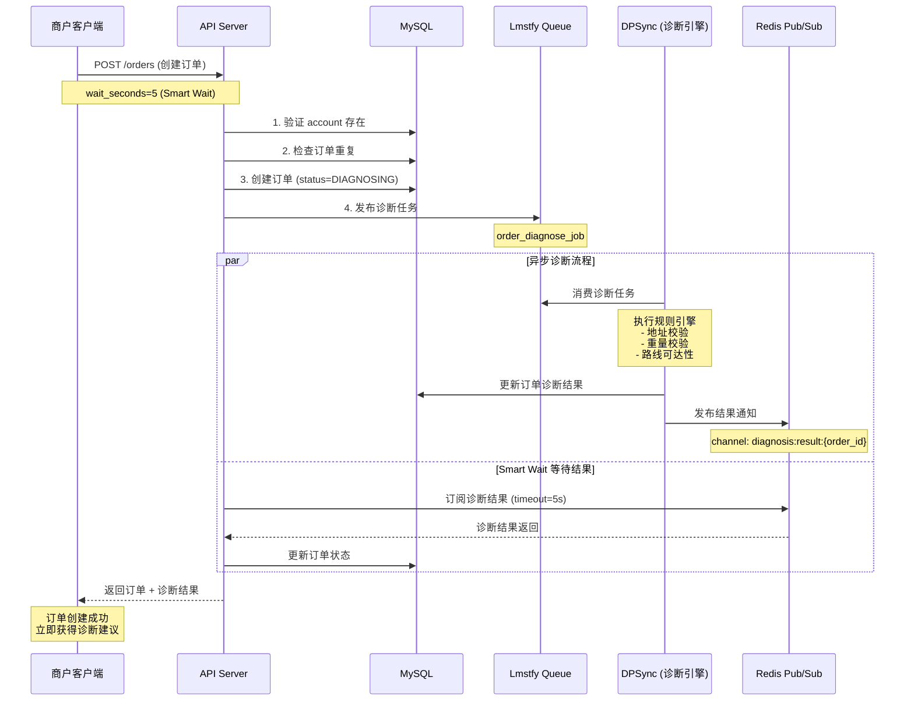
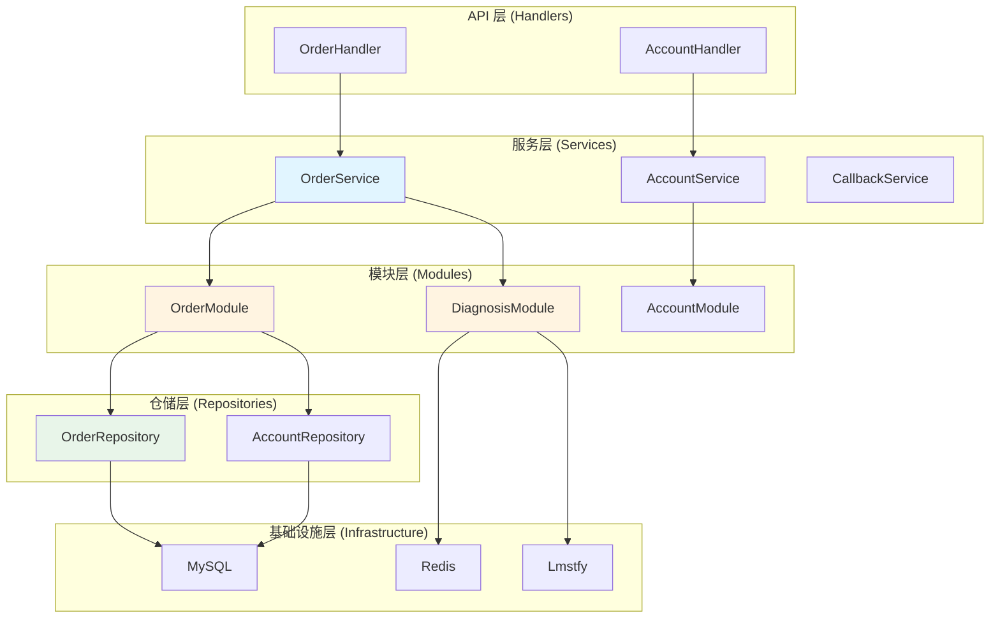

# DPMain 架构设计文档（第一部分）

## 目录
1. [业务背景](#1-业务背景)
2. [架构设计思路](#2-架构设计思路)

---

## 1. 业务背景

### 1.1 问题域：国际物流诊断系统

DPMain 是一个国际物流订单诊断系统（Order Intelligent Platform），核心业务场景是：

**典型用户故事：**
> 作为一个跨境电商商户，我需要创建国际物流订单并立即知道这个订单是否能够顺利发货，如果有问题（比如地址不完整、重量超限、目的地不可达），我希望在订单创建时就得到明确的诊断结果和建议。

### 1.2 核心业务流程



### 1.3 核心业务挑战

#### 挑战 1：异步流程的用户体验问题

**问题：** 传统的异步架构下，创建订单后需要轮询或等待回调才能获取诊断结果，用户体验差。

**解决方案：** **Smart Wait 机制**
- 客户端在创建订单时指定 `wait_seconds` 参数（如 5 秒）
- API Server 在发布诊断任务后，通过 Redis Pub/Sub **同步等待**诊断结果
- 如果在超时时间内收到结果，立即返回；否则返回 `status=DIAGNOSING`，客户端可后续查询

**业务价值：**
- 大部分订单（80%+）可在 2-3 秒内完成诊断，客户端无需轮询
- 复杂订单超时后不阻塞，保证系统响应性能

#### 挑战 2：数据一致性与性能平衡

**问题：** 诊断引擎需要访问订单的完整货件信息（Shipment），如何避免：
1. 重复查询数据库（性能问题）
2. 数据不一致（诊断时订单已被修改）

**解决方案：** **消息自包含设计**
```go
// 诊断任务消息中包含完整的 Shipment 数据（map 格式）
message := model.OrderDiagnoseJob{
    Payload: model.OrderDiagnosePayload{
        Data: model.OrderDiagnoseData{
            OrderID:         order.ID,
            AccountID:       order.AccountID,
            MerchantOrderNo: order.MerchantOrderNo,
            Shipment:        shipmentMap, // 完整货件信息，避免 DPSync 查询 DB
        },
    },
}
```

**业务价值：**
- DPSync 无需访问 DPMain 的数据库，实现服务解耦
- 诊断基于订单创建时的快照，保证数据一致性

#### 挑战 3：错误处理的明确性

**问题：** 在复杂的异步流程中，错误很容易被吞掉，导致：
- 订单卡在 `DIAGNOSING` 状态无人知晓
- 监控告警缺失，问题难以排查

**解决方案：** **显式错误处理原则**（Go 的最佳实践）
```go
// ❌ 错误的做法：静默失败
if err := s.diagnosisModule.PublishDiagnoseJob(ctx, order); err != nil {
    // 什么都不做，订单已创建，但没有诊断任务
}

// ✅ 正确的做法：记录日志但不阻断流程
if err := s.diagnosisModule.PublishDiagnoseJob(ctx, order); err != nil {
    log.Printf("[WARN] publish diagnose job failed: order_id=%s, error=%v", order.ID, err)
    // 订单已创建成功，发布失败不影响订单持久化，但需要告警
}

// ✅ 严重错误必须返回
if err := s.orderModule.CreateOrder(ctx, order); err != nil {
    return nil, fmt.Errorf("save order failed: %w", err) // 致命错误，必须返回
}
```

**设计原则：**
- **区分可恢复错误和致命错误**：数据库写入失败是致命错误，队列发布失败是可恢复错误
- **所有错误必须被处理**：要么返回给调用方，要么记录日志（便于监控告警）
- **使用 `%w` 包装错误**：保留错误链，便于追踪根因

---

## 2. 架构设计思路

### 2.1 从问题到方案的演进路径

#### 阶段 1：单体架构（MVP 版本）

**为什么选择单体架构？**

很多团队在做微服务架构时，会不假思索地拆分成多个服务：
```
api-service    (处理 HTTP 请求)
order-service  (订单逻辑)
diagnose-service (诊断逻辑)
callback-consumer (回调消费者)
```

**这种拆分在早期阶段是过度设计，原因如下：**

| 维度 | 单体架构 | 微服务架构 | 选择依据 |
|------|---------|-----------|---------|
| **团队规模** | 1-5 人 | 10+ 人 | 团队只有 2-3 人，没有必要按服务拆分 |
| **业务复杂度** | 单一业务域（物流诊断） | 多业务域 | 当前只有订单诊断一个核心场景 |
| **调用链路** | 进程内函数调用（纳秒级） | RPC 调用（毫秒级） | 订单创建涉及多次调用，单体性能更优 |
| **部署复杂度** | 单个二进制文件 | 多服务编排 | 减少运维成本，快速迭代 |
| **错误排查** | 单进程日志 | 分布式追踪 | 早期阶段无需引入复杂的链路追踪 |

**DPMain 的单体架构设计：**
```
┌─────────────────────────────────────┐
│         DPMain (单进程)              │
├─────────────────────────────────────┤
│  HTTP Server (Gin)                  │  ← 处理 API 请求
│  ├─ OrderHandler                    │
│  ├─ AccountHandler                  │
│  └─ Router                          │
├─────────────────────────────────────┤
│  Callback Consumer (Goroutine)      │  ← 消费回调消息
│  └─ CallbackConsumer.Start()        │
├─────────────────────────────────────┤
│  Shared Dependencies                │
│  ├─ MySQL Connection Pool           │
│  ├─ Redis Client                    │
│  └─ Lmstfy Client                   │
└─────────────────────────────────────┘
```

**关键设计决策：**
1. **HTTP Server 和 Consumer 在同一进程**：共享数据库连接池和基础设施客户端，减少资源占用
2. **Consumer 使用 Goroutine 而非独立进程**：Go 的并发模型天然支持轻量级线程，无需拆分进程
3. **依赖注入管理生命周期**：通过 Wire 在启动时初始化所有依赖，cleanup 函数统一释放资源

#### 阶段 2：引入 DDD 分层架构

**为什么需要分层？**

即使是单体架构，也需要清晰的代码组织，否则会面临：
- **意大利面代码**：Handler 直接操作数据库，业务逻辑和数据访问混在一起
- **难以测试**：无法 mock 数据库，单元测试依赖真实数据库环境
- **难以扩展**：更换数据库（MySQL → PostgreSQL）需要改动大量代码

**DDD 分层架构的核心目标：**
```
关注点分离 (Separation of Concerns)
  ↓
不同层次的代码有不同的职责
  ↓
每一层都可以独立测试和替换
```

**DPMain 的分层设计：**


**各层职责：**

| 层次 | 职责 | 示例代码 | 为什么需要这一层？ |
|------|------|---------|------------------|
| **API 层** | DTO 转换，参数校验，HTTP 错误码映射 | `OrderHandler.CreateOrder()` | 隔离 HTTP 协议细节，领域层不依赖 Gin 框架 |
| **服务层** | 业务流程编排，跨模块协调 | `OrderService.CreateOrder()` | 复杂业务场景需要多个模块协同，服务层负责编排 |
| **模块层** | 单一业务模块的逻辑封装 | `OrderModule.CreateOrder()`<br/>`DiagnosisModule.PublishDiagnoseJob()` | 模块是可复用的业务单元，可以被不同服务组合调用 |
| **仓储层** | 数据访问抽象 | `OrderRepository.Create()` | 隔离数据库实现细节，便于测试和更换数据库 |
| **基础设施层** | 外部依赖封装 | `redis.PubSubClient`<br/>`lmstfy.Client` | 封装第三方库的调用细节，提供统一接口 |

### 2.2 核心设计原则

#### 原则 1：依赖倒置原则 (Dependency Inversion Principle)

**定义：** 高层模块不应依赖低层模块，两者都应依赖抽象。

**在 DPMain 中的应用：**
```go
// ❌ 错误的做法：OrderModule 直接依赖 GORM 实现
type OrderModule struct {
    db *gorm.DB  // 直接依赖具体实现
}

func (m *OrderModule) CreateOrder(order *Order) error {
    return m.db.Create(order).Error  // 模块层知道 GORM 的存在
}

// ✅ 正确的做法：OrderModule 依赖 Repository 接口
type OrderModule struct {
    orderRepo OrderRepository  // 依赖抽象接口
}

func (m *OrderModule) CreateOrder(order *Order) error {
    return m.orderRepo.Create(order)  // 模块层不知道具体实现
}
```

**好处：**
- 测试时可以 mock `OrderRepository`，无需启动真实数据库
- 更换数据库时只需修改 Repository 实现，模块层代码无需改动

#### 原则 2：单一职责原则 (Single Responsibility Principle)

**在 DPMain 中的应用：**

**反例：所有逻辑都在 Handler 中**
```go
// ❌ Handler 职责过多：参数校验 + 业务逻辑 + 数据访问
func (h *OrderHandler) CreateOrder(c *gin.Context) {
    var req CreateOrderRequest
    if err := c.ShouldBindJSON(&req); err != nil {
        c.JSON(400, gin.H{"error": err.Error()})
        return
    }

    // 业务逻辑：检查账号存在
    var account Account
    if err := h.db.First(&account, req.AccountID).Error; err != nil {
        c.JSON(404, gin.H{"error": "account not found"})
        return
    }

    // 业务逻辑：检查订单重复
    var existing Order
    h.db.Where("account_id = ? AND merchant_order_no = ?", req.AccountID, req.MerchantOrderNo).First(&existing)

    // 业务逻辑：创建订单
    order := Order{ID: uuid.New().String(), ...}
    h.db.Create(&order)

    // 业务逻辑：发布诊断任务
    h.lmstfyClient.Publish("diagnose_queue", order)

    c.JSON(200, order)
}
```

**正例：职责分离**
```go
// ✅ Handler 只负责：参数校验、DTO 转换、HTTP 响应
func (h *OrderHandler) CreateOrder(c *gin.Context) {
    var req CreateOrderRequest
    if err := c.ShouldBindJSON(&req); err != nil {
        c.JSON(400, gin.H{"error": err.Error()})
        return
    }

    // 业务逻辑委托给 Service
    order, err := h.orderService.CreateOrder(c.Request.Context(), req.AccountID, req.MerchantOrderNo, req.Shipment, req.WaitSeconds)
    if err != nil {
        c.JSON(500, gin.H{"error": err.Error()})
        return
    }

    c.JSON(200, toOrderResponse(order))
}

// ✅ Service 负责：业务流程编排
func (s *OrderService) CreateOrder(ctx context.Context, accountID int64, merchantOrderNo string, shipment *Shipment, waitSeconds int) (*Order, error) {
    // 1. 验证账号（委托给 Module）
    exists, err := s.orderModule.AccountExists(ctx, accountID)
    if err != nil || !exists {
        return nil, errors.New("account not found")
    }

    // 2. 检查重复（委托给 Module）
    existing, _ := s.orderModule.GetOrderByAccountAndMerchantNo(ctx, accountID, merchantOrderNo)
    if existing != nil {
        return nil, errors.New("order already exists")
    }

    // 3. 创建订单（委托给 Module）
    order := etorder.NewOrder(uuid.New().String(), accountID, merchantOrderNo, shipment)
    s.orderModule.CreateOrder(ctx, order)

    // 4. 发布诊断任务（委托给 DiagnosisModule）
    s.diagnosisModule.PublishDiagnoseJob(ctx, order)

    // 5. Smart Wait（委托给 DiagnosisModule）
    if waitSeconds > 0 {
        result, _ := s.diagnosisModule.WaitForDiagnosisResult(ctx, order.ID, time.Duration(waitSeconds)*time.Second)
        if result != nil {
            order.UpdateDiagnoseResult(result)
            s.orderModule.UpdateDiagnoseResult(ctx, order.ID, result)
        }
    }

    return order, nil
}
```

**职责清晰后的好处：**
- Handler 的单元测试只需 mock `OrderService`
- Service 的单元测试只需 mock `OrderModule` 和 `DiagnosisModule`
- 每一层都可以独立测试，无需启动完整的应用

#### 原则 3：实用主义优于教条主义

**DDD 的经典分层：**
```
API 层 (Presentation)
  ↓
应用服务层 (Application Service)
  ↓
领域服务层 (Domain Service)
  ↓
仓储层 (Repository)
  ↓
基础设施层 (Infrastructure)
```

**DPMain 的实用主义调整：**
```
API 层
  ↓
服务层 (相当于 Application Service)
  ↓
模块层 (相当于 Domain Service + 业务编排)
  ↓
仓储层 (接口 + 实现放在一起)
  ↓
基础设施层 (部分直接被模块层依赖)
```

**为什么做这些调整？**

| 经典 DDD 实践 | DPMain 的实用主义调整 | 理由 |
|--------------|---------------------|------|
| Repository 接口在 Domain 层，实现在 Infrastructure 层 | Repository 接口和实现都在 `domains/repo/rporder` | 中型项目中，开发者需要频繁查看接口和实现，放在一起提高开发效率 |
| Domain Service 不依赖 Infrastructure | DiagnosisModule 直接依赖 `lmstfy.Client` 和 `redis.PubSubClient` | Redis 和 Lmstfy 是基础设施服务（非数据存储），不需要 Repository 抽象 |
| 严格禁止循环依赖 | 允许 Module 层的模块之间组合，但通过依赖注入管理 | 业务场景需要模块协同（如 OrderModule + DiagnosisModule），通过构造函数注入避免运行时循环依赖 |

**核心思想：**
> 架构设计不是为了炫技，而是为了解决实际问题。在团队规模、业务复杂度有限的情况下，适度的实用主义可以提高开发效率，避免过度设计。

### 2.3 设计演进的关键里程碑

#### 里程碑 1：识别反向依赖问题

**问题发现：**
```go
// ❌ OrderModule 依赖 DiagnosisService（下层依赖上层）
type OrderModule struct {
    orderRepo        OrderRepository
    accountRepo      AccountRepository
    diagnosisService *DiagnosisService  // 模块层依赖服务层，违反分层原则
}
```

**问题根源：**
- 最初设计时，认为"诊断"是一个服务，所以创建了 `DiagnosisService`
- 但 `OrderModule` 需要在创建订单后立即发布诊断任务，导致模块层依赖服务层

**解决方案：**
- 将 `DiagnosisService` 重构为 `DiagnosisModule`，提升到模块层
- `OrderService` 同时依赖 `OrderModule` 和 `DiagnosisModule`，由服务层编排

**架构演进：**
```
Before:
OrderService → OrderModule → DiagnosisService  ❌ 循环依赖

After:
OrderService → OrderModule     ✅ 清晰的依赖关系
            → DiagnosisModule
```

#### 里程碑 2：统一错误处理策略

**问题发现：**
```go
// ❌ 错误被静默吞掉
result, err := s.diagnosisModule.WaitForDiagnosisResult(ctx, order.ID, timeout)
if result != nil {  // 只检查 result，不检查 err
    order.UpdateDiagnoseResult(result)
}
return order, nil  // 即使 err != nil 也返回成功
```

**问题影响：**
- 订阅 Redis 失败时，订单卡在 `DIAGNOSING` 状态，但 API 返回成功
- 监控系统无法感知这类错误，问题难以排查

**解决方案：**
```go
// ✅ 显式处理所有错误
result, err := s.diagnosisModule.WaitForDiagnosisResult(ctx, order.ID, timeout)
if err != nil {
    log.Printf("[WARN] wait for diagnosis result failed: order_id=%s, error=%v", order.ID, err)
    return order, nil  // 超时是预期行为，返回 DIAGNOSING 状态的订单
}

if result != nil {
    if err := order.UpdateDiagnoseResult(result); err != nil {
        return nil, fmt.Errorf("update order entity failed: %w", err)  // 致命错误必须返回
    }

    if err := s.orderModule.UpdateDiagnoseResult(ctx, order.ID, result); err != nil {
        log.Printf("[ERROR] persist diagnose result failed: order_id=%s, error=%v", order.ID, err)
        return nil, fmt.Errorf("persist diagnose result failed: %w", err)
    }
}
```

**设计原则：**
- **所有错误都必须被处理**：要么返回给调用方，要么记录日志
- **区分错误级别**：`[WARN]` 表示可恢复错误，`[ERROR]` 表示需要人工介入
- **使用 `%w` 包装错误**：保留错误栈，便于追踪根因

#### 里程碑 3：Repository 实现的位置调整

**问题发现：**
```
infra/persistence/mysql/order_repo_impl.go
infra/persistence/mysql/account_repo_impl.go
```

开发者在查看 `OrderRepository` 接口后，需要跨多个目录才能找到实现，降低了开发效率。

**解决方案：**
```
domains/repo/rporder/order_repository.go       (接口)
domains/repo/rporder/order_repo_impl.go        (实现)
domains/repo/rpaccount/account_repository.go   (接口)
domains/repo/rpaccount/account_repo_impl.go    (实现)
```

**为什么这样做？**
- **中型项目的实用主义**：接口和实现放在一起，开发者可以快速查看和修改
- **不违反 DDD 原则**：实现仍然依赖注入，测试时可以 mock 接口
- **便于包管理**：每个 Repository 独立一个包，避免循环依赖

---

## 下一部分预告

在 [第二部分：DDD 理论与应用](./02_ddd_theory_and_application.md) 中，我们将深入探讨：
- DDD 的核心概念（实体、值对象、聚合根、领域服务）
- 如何进行领域建模（从业务场景到代码实现）
- DPMain 中的领域对象设计（Order、Shipment、DiagnoseResult）
- 为什么 Order 是聚合根？为什么 Shipment 是值对象？
