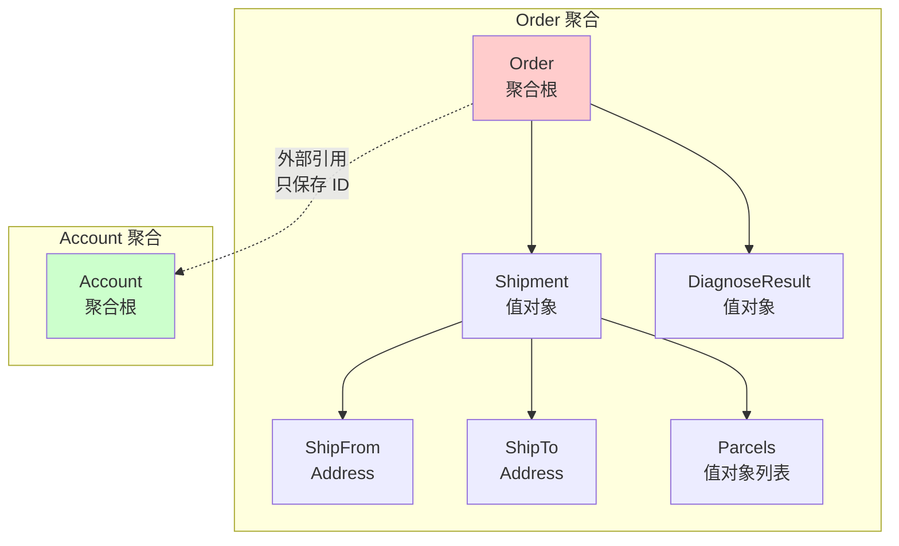
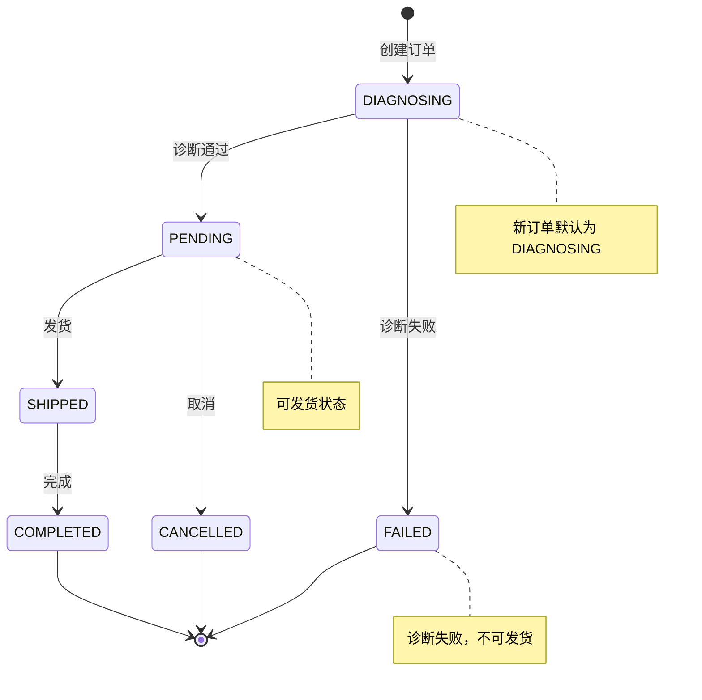

# DPMain 架构设计文档（第二部分）

## 目录
3. [DDD 理论与应用](#3-ddd-理论与应用)

---

## 3. DDD 理论与应用

### 3.1 为什么需要 DDD？

#### 传统开发模式的痛点

**场景：** 假设你是一个新加入团队的开发者，需要修改订单创建逻辑。

**传统的"贫血模型"代码：**
```go
// models/order.go (只有数据字段，没有业务逻辑)
type Order struct {
    ID              string
    AccountID       int64
    MerchantOrderNo string
    Status          string
    ShipFromCountry string
    ShipFromCity    string
    ShipToCountry   string
    ShipToCity      string
    Weight          float64
    CreatedAt       time.Time
    UpdatedAt       time.Time
}

// services/order_service.go (所有逻辑都在 Service 层)
func (s *OrderService) CreateOrder(req CreateOrderRequest) error {
    // 验证逻辑散落在各处
    if req.ShipFromCountry == "" || req.ShipToCountry == "" {
        return errors.New("country is required")
    }
    if req.Weight <= 0 || req.Weight > 30 {
        return errors.New("invalid weight")
    }

    order := &Order{
        ID:              uuid.New().String(),
        AccountID:       req.AccountID,
        MerchantOrderNo: req.MerchantOrderNo,
        Status:          "PENDING",
        ShipFromCountry: req.ShipFromCountry,
        ShipFromCity:    req.ShipFromCity,
        ShipToCountry:   req.ShipToCountry,
        ShipToCity:      req.ShipToCity,
        Weight:          req.Weight,
        CreatedAt:       time.Now(),
    }

    return s.db.Create(order).Error
}

// 另一个开发者在另一个地方也写了类似的验证逻辑
func (s *OrderService) UpdateOrder(orderID string, req UpdateOrderRequest) error {
    var order Order
    s.db.First(&order, orderID)

    // 重复的验证逻辑（容易遗漏或不一致）
    if req.Weight <= 0 || req.Weight > 30 {
        return errors.New("invalid weight")
    }

    order.Weight = req.Weight
    order.UpdatedAt = time.Now()
    return s.db.Save(&order).Error
}
```

**问题分析：**
1. **业务逻辑分散**：订单的验证规则散落在多个 Service 方法中，容易不一致
2. **难以理解**：新人需要阅读所有 Service 代码才能理解"订单"这个概念的完整规则
3. **难以测试**：验证逻辑和数据库操作耦合，必须启动数据库才能测试
4. **容易出错**：修改订单状态时，没有任何约束，可能出现非法状态转换（如 `COMPLETED` → `PENDING`）

#### DDD 的核心思想

**核心理念：** 将业务规则封装到领域对象中，让代码反映真实的业务逻辑。

**DDD 重构后的代码：**
```go
// domains/entity/etorder/order.go (富领域模型)
type Order struct {
    id              string
    accountID       int64
    merchantOrderNo string
    status          OrderStatus  // 使用类型安全的枚举
    shipment        *Shipment    // 货件信息封装为值对象
    diagnoseResult  *DiagnoseResult
    createdAt       time.Time
    updatedAt       time.Time
}

// 工厂方法：确保创建的 Order 总是符合业务规则
func NewOrder(id string, accountID int64, merchantOrderNo string, shipment *Shipment) (*Order, error) {
    if id == "" || merchantOrderNo == "" {
        return nil, errors.New("id and merchant_order_no are required")
    }
    if accountID <= 0 {
        return nil, errors.New("invalid account_id")
    }
    if err := validateShipment(shipment); err != nil {
        return nil, fmt.Errorf("invalid shipment: %w", err)
    }

    return &Order{
        id:              id,
        accountID:       accountID,
        merchantOrderNo: merchantOrderNo,
        status:          OrderStatusDiagnosing,  // 新订单默认为 DIAGNOSING
        shipment:        shipment,
        createdAt:       time.Now(),
    }, nil
}

// 业务方法：状态转换的业务规则封装在实体内部
func (o *Order) UpdateDiagnoseResult(result *DiagnoseResult) error {
    // 业务规则：只有 DIAGNOSING 状态的订单才能更新诊断结果
    if o.status != OrderStatusDiagnosing {
        return fmt.Errorf("cannot update diagnose result for order in status %s", o.status)
    }

    o.diagnoseResult = result

    // 业务规则：根据诊断结果自动转换状态
    if result.CanShip {
        o.status = OrderStatusPending  // 可发货
    } else {
        o.status = OrderStatusFailed   // 不可发货
    }

    o.updatedAt = time.Now()
    return nil
}
```

**改进后的优势：**
1. **业务规则集中**：所有关于订单的规则都在 `Order` 实体中，一目了然
2. **类型安全**：使用 `OrderStatus` 枚举替代字符串，编译期就能发现错误
3. **不变性保证**：通过私有字段 + 公共方法，确保订单状态转换总是合法的
4. **易于测试**：`UpdateDiagnoseResult()` 是纯函数，无需数据库即可测试

### 3.2 DDD 核心概念

#### 概念 1：实体 (Entity)

**定义：** 有唯一标识的领域对象，生命周期内标识不变，但属性可以变化。

**判断标准：**
> 两个对象的所有属性都相同，但它们仍然是不同的对象吗？
> - 如果是 → 实体（Entity）
> - 如果不是 → 值对象（Value Object）

**在 DPMain 中的应用：**
```go
// Order 是实体：每个订单有唯一的 ID
type Order struct {
    id              string  // 唯一标识
    accountID       int64
    merchantOrderNo string
    status          OrderStatus
    shipment        *Shipment
    diagnoseResult  *DiagnoseResult
}

// 两个订单即使所有属性相同，也是不同的订单（因为 ID 不同）
order1 := NewOrder("order-123", 1, "M001", shipment)
order2 := NewOrder("order-456", 1, "M001", shipment)
// order1 != order2，因为它们的 ID 不同
```

**实体的特征：**
- **唯一标识**：`order.ID` 是订单的唯一标识
- **可变性**：订单的状态可以从 `DIAGNOSING` 变为 `PENDING`，但它仍然是同一个订单
- **生命周期**：订单有创建时间、更新时间，可以被追踪

#### 概念 2：值对象 (Value Object)

**定义：** 没有唯一标识，通过属性值来判断相等性的对象。

**判断标准：**
> 两个对象的所有属性都相同，它们就是同一个对象吗？
> - 如果是 → 值对象（Value Object）
> - 如果不是 → 实体（Entity）

**在 DPMain 中的应用：**
```go
// Shipment 是值对象：两个 Shipment 的所有字段相同，则它们相等
type Shipment struct {
    ShipFrom *Address
    ShipTo   *Address
    Parcels  []*Parcel
}

type Address struct {
    Country string
    State   string
    City    string
    Address1 string
    PostalCode string
}

type Parcel struct {
    Weight float64
    Length float64
    Width  float64
    Height float64
}

// 两个地址的所有字段相同，则它们是同一个地址
addr1 := &Address{Country: "US", City: "New York", Address1: "123 Main St"}
addr2 := &Address{Country: "US", City: "New York", Address1: "123 Main St"}
// addr1 == addr2（值相等）
```

**值对象的特征：**
- **不可变性**：创建后不能修改，如果需要修改，创建一个新的值对象
- **无唯一标识**：通过属性值判断相等性
- **可替换性**：两个值相同的值对象可以互相替换

**为什么 Shipment 是值对象而不是实体？**
- 货件信息没有独立的生命周期，它依附于订单存在
- 两个订单的货件信息完全相同时，它们可以共享同一个 Shipment 对象
- 修改货件信息时，实际上是创建一个新的订单（或订单版本），而不是修改原有货件

#### 概念 3：聚合根 (Aggregate Root)

**定义：** 一组具有内聚关系的实体和值对象的集合，聚合根是这个集合的入口。

**核心规则：**
1. **外部只能引用聚合根**：不能直接引用聚合内部的对象
2. **聚合内部对象的修改必须通过聚合根**：保证业务规则的一致性
3. **聚合是事务边界**：一个事务只能修改一个聚合

**在 DPMain 中的应用：**
```go
// Order 是聚合根
type Order struct {
    id              string  // 聚合根的唯一标识
    accountID       int64
    merchantOrderNo string
    status          OrderStatus
    shipment        *Shipment         // 聚合内部对象（值对象）
    diagnoseResult  *DiagnoseResult   // 聚合内部对象（值对象）
}

// ✅ 正确的做法：通过聚合根修改聚合内部对象
func (o *Order) UpdateDiagnoseResult(result *DiagnoseResult) error {
    // 聚合根负责维护业务规则
    if o.status != OrderStatusDiagnosing {
        return errors.New("invalid status transition")
    }

    o.diagnoseResult = result

    // 聚合根负责维护内部对象的一致性
    if result.CanShip {
        o.status = OrderStatusPending
    } else {
        o.status = OrderStatusFailed
    }

    return nil
}

// ❌ 错误的做法：直接修改聚合内部对象
func SomeService(order *Order) {
    // 绕过聚合根，直接修改内部对象，可能导致不一致
    order.diagnoseResult = &DiagnoseResult{CanShip: true}
    // 忘记更新 order.status，导致数据不一致
}
```

**聚合的边界设计：**


**为什么 Order 和 Account 不在同一个聚合中？**
- **独立的生命周期**：订单可以独立创建、修改、删除，无需加载 Account
- **不同的事务边界**：修改订单不应该锁定 Account（否则并发性能差）
- **引用方式**：Order 只保存 `accountID`，而不是持有 `Account` 对象

#### 概念 4：领域服务 (Domain Service)

**定义：** 无状态的业务逻辑封装，当业务操作不适合放在任何一个实体中时使用。

**使用场景：**
- 业务逻辑涉及多个聚合
- 业务逻辑本身不属于某个特定实体

**在 DPMain 中的应用：**
```go
// OrderModule 是领域服务（模块层）
type OrderModule struct {
    orderRepo   OrderRepository
    accountRepo AccountRepository
}

// 这个业务逻辑涉及两个聚合（Order + Account），不适合放在 Order 实体中
func (m *OrderModule) AccountExists(ctx context.Context, accountID int64) (bool, error) {
    return m.accountRepo.Exists(ctx, accountID)
}

// DiagnosisModule 也是领域服务
type DiagnosisModule struct {
    lmstfyClient *lmstfy.Client
    redisClient  *redis.PubSubClient
    queueName    string
}

// 这个业务逻辑涉及外部系统（Lmstfy、Redis），不属于 Order 实体的职责
func (m *DiagnosisModule) PublishDiagnoseJob(ctx context.Context, order *Order) error {
    message := model.OrderDiagnoseJob{
        Payload: model.OrderDiagnosePayload{
            Data: model.OrderDiagnoseData{
                OrderID:   order.ID,
                AccountID: order.AccountID,
                Shipment:  order.Shipment,
            },
        },
    }
    return m.lmstfyClient.Publish(ctx, m.queueName, message)
}
```

**领域服务 vs 应用服务：**

| 维度 | 领域服务 (Domain Service) | 应用服务 (Application Service) |
|------|-------------------------|------------------------------|
| **职责** | 封装领域逻辑 | 编排业务流程 |
| **示例** | `OrderModule.AccountExists()` | `OrderService.CreateOrder()` |
| **是否有状态** | 无状态（只依赖注入的依赖） | 无状态（只依赖注入的依赖） |
| **是否涉及基础设施** | 可以依赖 Repository 和基础设施 | 只依赖领域层，不直接依赖基础设施 |
| **是否涉及事务** | 不管理事务 | 负责管理事务边界 |

#### 概念 5：仓储 (Repository)

**定义：** 封装数据访问逻辑，让领域层以集合的方式操作聚合根。

**核心思想：**
> Repository 让领域层感觉像在操作一个内存中的集合，而不是数据库。

**在 DPMain 中的应用：**
```go
// Repository 接口（领域层定义）
type OrderRepository interface {
    Create(ctx context.Context, order *etorder.Order) error
    GetByID(ctx context.Context, orderID string) (*etorder.Order, error)
    GetByAccountAndMerchantNo(ctx context.Context, accountID int64, merchantOrderNo string) (*etorder.Order, error)
    UpdateDiagnoseResult(ctx context.Context, orderID string, result *etorder.DiagnoseResult) error
    List(ctx context.Context, accountID int64, page, limit int) ([]*etorder.Order, int64, error)
}

// Repository 实现（基础设施层）
type OrderRepositoryImpl struct {
    db *gorm.DB
}

func (r *OrderRepositoryImpl) Create(ctx context.Context, order *etorder.Order) error {
    // 将领域对象转换为数据库模型
    po := toOrderPO(order)
    return r.db.WithContext(ctx).Create(po).Error
}

func (r *OrderRepositoryImpl) GetByID(ctx context.Context, orderID string) (*etorder.Order, error) {
    var po OrderPO
    if err := r.db.WithContext(ctx).First(&po, "id = ?", orderID).Error; err != nil {
        if errors.Is(err, gorm.ErrRecordNotFound) {
            return nil, nil
        }
        return nil, err
    }

    // 将数据库模型转换为领域对象
    return toDomainOrder(&po), nil
}
```

**Repository 的关键点：**
1. **接口由领域层定义**：Repository 的方法反映业务需求，而不是数据库操作
2. **实现由基础设施层提供**：隔离数据库实现细节
3. **只操作聚合根**：不提供 `GetShipmentByID()` 这样的方法，因为 Shipment 不是聚合根
4. **领域对象 ↔ 持久化对象转换**：Repository 负责转换逻辑

### 3.3 领域建模实战

#### 步骤 1：识别核心概念（名词提取）

**业务需求：**
> 商户可以创建国际物流订单，订单包含发件人地址、收件人地址、包裹信息。系统会对订单进行诊断，判断是否可以发货。

**名词提取：**
- **商户 (Account)**：下单的主体
- **订单 (Order)**：核心业务对象
- **地址 (Address)**：发件人/收件人信息
- **包裹 (Parcel)**：货物信息
- **货件 (Shipment)**：完整的发货信息（发件人 + 收件人 + 包裹）
- **诊断结果 (DiagnoseResult)**：诊断引擎返回的结果

#### 步骤 2：区分实体与值对象

| 概念 | 类型 | 理由 |
|------|------|------|
| Order | 实体 | 有唯一 ID，有生命周期，状态可变 |
| Account | 实体 | 有唯一 ID，可以独立管理 |
| Shipment | 值对象 | 无独立 ID，依附于 Order，不可变 |
| Address | 值对象 | 通过属性值判断相等性，可共享 |
| Parcel | 值对象 | 通过属性值判断相等性，可共享 |
| DiagnoseResult | 值对象 | 诊断结果快照，不可变 |

#### 步骤 3：设计聚合边界

**Order 聚合：**
```go
type Order struct {
    id              string
    accountID       int64  // 外部引用（只保存 ID）
    merchantOrderNo string
    status          OrderStatus
    shipment        *Shipment         // 内部对象（值对象）
    diagnoseResult  *DiagnoseResult   // 内部对象（值对象）
    createdAt       time.Time
    updatedAt       time.Time
}

type Shipment struct {
    ShipFrom *Address
    ShipTo   *Address
    Parcels  []*Parcel
}

type Address struct {
    Country    string
    State      string
    City       string
    Address1   string
    PostalCode string
}

type Parcel struct {
    Weight float64
    Length float64
    Width  float64
    Height float64
}

type DiagnoseResult struct {
    CanShip bool
    Reasons []string
}
```

**Account 聚合：**
```go
type Account struct {
    id        int64
    name      string
    apiKey    string
    createdAt time.Time
}
```

**为什么 Shipment 不是聚合根？**
- **没有独立的业务价值**：Shipment 必须依附于 Order 存在，不能单独创建
- **没有独立的生命周期**：Shipment 的创建、修改、删除都由 Order 管理
- **没有独立的查询需求**：不会有"查询所有 Shipment"的业务场景

#### 步骤 4：定义业务方法

**Order 实体的业务方法：**
```go
// 工厂方法：创建订单
func NewOrder(id string, accountID int64, merchantOrderNo string, shipment *Shipment) (*Order, error) {
    // 业务规则：参数校验
    if id == "" || merchantOrderNo == "" {
        return nil, errors.New("id and merchant_order_no are required")
    }
    if accountID <= 0 {
        return nil, errors.New("invalid account_id")
    }
    if err := validateShipment(shipment); err != nil {
        return nil, fmt.Errorf("invalid shipment: %w", err)
    }

    return &Order{
        id:              id,
        accountID:       accountID,
        merchantOrderNo: merchantOrderNo,
        status:          OrderStatusDiagnosing,  // 业务规则：新订单默认为 DIAGNOSING
        shipment:        shipment,
        createdAt:       time.Now(),
    }, nil
}

// 业务方法：更新诊断结果
func (o *Order) UpdateDiagnoseResult(result *DiagnoseResult) error {
    // 业务规则：只有 DIAGNOSING 状态的订单才能更新诊断结果
    if o.status != OrderStatusDiagnosing {
        return fmt.Errorf("cannot update diagnose result for order in status %s", o.status)
    }

    o.diagnoseResult = result

    // 业务规则：根据诊断结果自动转换状态
    if result.CanShip {
        o.status = OrderStatusPending
    } else {
        o.status = OrderStatusFailed
    }

    o.updatedAt = time.Now()
    return nil
}

// 业务方法：标记订单为已发货
func (o *Order) MarkAsShipped() error {
    // 业务规则：只有 PENDING 状态的订单才能发货
    if o.status != OrderStatusPending {
        return fmt.Errorf("cannot ship order in status %s", o.status)
    }

    o.status = OrderStatusShipped
    o.updatedAt = time.Now()
    return nil
}
```

**状态机设计：**


### 3.4 DDD 的实用主义权衡

#### 权衡 1：贫血模型 vs 富领域模型

**贫血模型：**
```go
// ❌ 贫血模型：实体只有数据字段
type Order struct {
    ID              string
    AccountID       int64
    Status          string  // 使用字符串，容易出错
    DiagnoseResult  string  // 使用 JSON 字符串
}

// 业务逻辑都在 Service 层
func (s *OrderService) UpdateDiagnoseResult(orderID string, result DiagnoseResult) error {
    var order Order
    s.db.First(&order, orderID)

    if order.Status != "DIAGNOSING" {  // 硬编码字符串，容易拼写错误
        return errors.New("invalid status")
    }

    resultJSON, _ := json.Marshal(result)
    order.DiagnoseResult = string(resultJSON)

    if result.CanShip {
        order.Status = "PENDING"
    } else {
        order.Status = "FAILED"
    }

    return s.db.Save(&order).Error
}
```

**富领域模型：**
```go
// ✅ 富领域模型：实体包含业务规则
type Order struct {
    id              string
    accountID       int64
    status          OrderStatus  // 使用枚举
    diagnoseResult  *DiagnoseResult
}

func (o *Order) UpdateDiagnoseResult(result *DiagnoseResult) error {
    // 业务规则封装在实体内部
    if o.status != OrderStatusDiagnosing {
        return fmt.Errorf("cannot update diagnose result for order in status %s", o.status)
    }

    o.diagnoseResult = result

    if result.CanShip {
        o.status = OrderStatusPending
    } else {
        o.status = OrderStatusFailed
    }

    return nil
}

// Service 层只负责编排
func (s *OrderService) UpdateDiagnoseResult(orderID string, result DiagnoseResult) error {
    order, err := s.orderModule.GetOrder(ctx, orderID)
    if err != nil {
        return err
    }

    if err := order.UpdateDiagnoseResult(&result); err != nil {
        return err
    }

    return s.orderModule.UpdateDiagnoseResult(ctx, orderID, &result)
}
```

**权衡建议：**
- **中型项目推荐富领域模型**：业务规则集中，易于维护
- **如果团队不熟悉 DDD**：可以从贫血模型开始，逐步重构为富领域模型

#### 权衡 2：严格分层 vs 实用主义

**严格的 DDD 分层：**
```
领域层 (Domain)
  ├─ 实体 (Entity)
  ├─ 值对象 (Value Object)
  ├─ 聚合根 (Aggregate Root)
  ├─ 领域服务 (Domain Service)
  └─ 仓储接口 (Repository Interface)

基础设施层 (Infrastructure)
  └─ 仓储实现 (Repository Implementation)
```

**DPMain 的实用主义调整：**
```
domains/entity/etorder/
  ├─ order.go          (实体 + 聚合根)
  ├─ shipment.go       (值对象)
  └─ diagnose_result.go (值对象)

domains/repo/rporder/
  ├─ order_repository.go      (Repository 接口)
  └─ order_repo_impl.go       (Repository 实现)  ← 接口和实现放在一起

domains/modules/mdorder/
  └─ order_module.go   (领域服务)

domains/modules/mddiagnosis/
  └─ diagnosis_module.go  (领域服务，直接依赖基础设施客户端)
```

**为什么这样调整？**
- **开发效率**：中型项目中，接口和实现放在一起方便查看和修改
- **包管理**：每个 Repository 独立一个包，避免循环依赖
- **测试便利性**：接口仍然可以 mock，不影响测试

#### 权衡 3：领域事件 vs 直接调用

**经典 DDD 实践：使用领域事件**
```go
// ✅ 领域事件：解耦聚合之间的依赖
func (o *Order) UpdateDiagnoseResult(result *DiagnoseResult) error {
    o.diagnoseResult = result
    o.status = OrderStatusPending

    // 发布领域事件
    o.AddEvent(OrderDiagnosedEvent{
        OrderID: o.id,
        Result:  result,
    })

    return nil
}

// 事件处理器
type OrderDiagnosedEventHandler struct {
    notificationService NotificationService
}

func (h *OrderDiagnosedEventHandler) Handle(event OrderDiagnosedEvent) {
    // 发送通知给商户
    h.notificationService.Notify(event.OrderID)
}
```

**DPMain 的实用主义选择：直接调用**
```go
// Service 层直接编排
func (s *OrderService) CreateOrder(...) (*Order, error) {
    order := NewOrder(...)
    s.orderModule.CreateOrder(ctx, order)

    // 直接调用诊断模块
    s.diagnosisModule.PublishDiagnoseJob(ctx, order)

    // 直接等待结果
    result, _ := s.diagnosisModule.WaitForDiagnosisResult(ctx, order.ID, timeout)

    return order, nil
}
```

**为什么不使用领域事件？**
- **业务流程简单**：订单创建 → 诊断 → 返回结果，是线性流程，不需要事件解耦
- **避免过度设计**：引入事件总线会增加系统复杂度，中型项目收益不大
- **调试便利性**：直接调用的调用链更清晰，便于排查问题

**什么时候应该使用领域事件？**
- 一个业务操作需要触发多个后续操作（如订单完成需要通知多个系统）
- 后续操作允许异步执行（不影响主流程）
- 需要解耦不同聚合之间的依赖

---

## 下一部分预告

在 [第三部分：核心架构设计](./03_core_architecture_design.md) 中，我们将深入探讨：
- 完整的分层架构设计（API → Service → Module → Repository → Infrastructure）
- 为什么需要 Module 层？它和 Service 层的区别是什么？
- Repository 实现为什么放在 domains/repo 而不是 infra？（架构权衡）
- 依赖注入的设计（为什么选择 Wire 而不是手写工厂？）
- 单进程多 Goroutine 的架构设计（HTTP Server + Consumer 共存）
