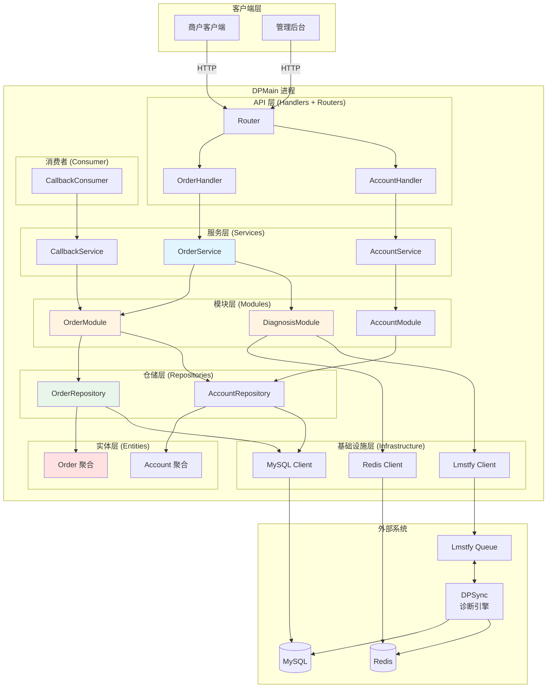
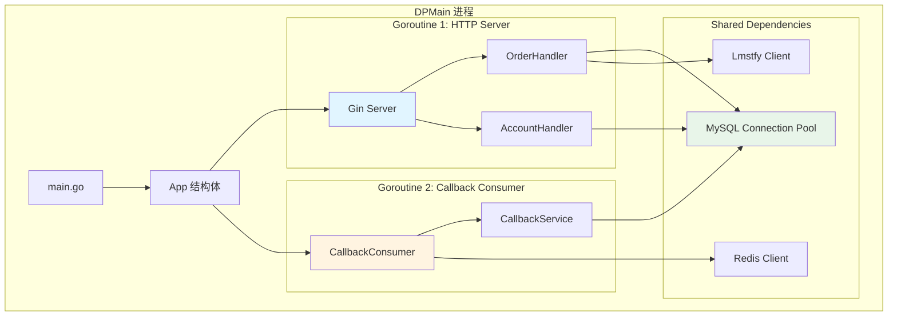

# DPMain 架构设计文档（第三部分）

## 目录
4. [核心架构设计](#4-核心架构设计)

---

## 4. 核心架构设计

### 4.1 完整分层架构

#### 整体架构图



#### 各层职责详解

| 层次 | 职责 | 输入 | 输出 | 依赖 |
|------|------|------|------|------|
| **API 层** | HTTP 请求处理、DTO 转换、参数校验、错误码映射 | HTTP Request | HTTP Response | Service 层 |
| **服务层** | 业务流程编排、跨模块协调、事务管理 | 领域对象 | 领域对象 | Module 层 |
| **模块层** | 单一业务模块的逻辑封装、组装 Repository 和基础设施 | 领域对象 | 领域对象 | Repository 层 + Infrastructure 层 |
| **仓储层** | 数据访问抽象、领域对象 ↔ 持久化对象转换 | 领域对象 | 领域对象 | Entity 层 + Infrastructure 层 |
| **实体层** | 业务规则封装、状态转换逻辑 | 参数 | 领域对象 | 无依赖 |
| **基础设施层** | 外部依赖封装（数据库、缓存、消息队列） | 请求参数 | 响应数据 | 第三方库 |

### 4.2 为什么需要 Module 层？

#### 问题背景：Service 层和 Repository 层之间的尴尬

**场景 1：简单的 CRUD 操作**
```go
// 如果没有 Module 层，Service 直接调用 Repository
func (s *OrderService) GetOrder(ctx context.Context, orderID string) (*Order, error) {
    return s.orderRepo.GetByID(ctx, orderID)  // 直接调用 Repository
}
```

**问题：** Service 层变成了 Repository 的简单代理，没有体现业务价值。

**场景 2：需要组合多个 Repository 的操作**
```go
// Service 层需要组合多个 Repository
func (s *OrderService) CreateOrder(ctx context.Context, accountID int64, ...) (*Order, error) {
    // 验证账号存在
    exists, err := s.accountRepo.Exists(ctx, accountID)
    if err != nil || !exists {
        return nil, errors.New("account not found")
    }

    // 检查订单重复
    existing, _ := s.orderRepo.GetByAccountAndMerchantNo(ctx, accountID, merchantOrderNo)
    if existing != nil {
        return nil, errors.New("order already exists")
    }

    // 创建订单
    order := NewOrder(...)
    return s.orderRepo.Create(ctx, order)
}
```

**问题：** Service 层混杂了"业务编排"和"数据操作组装"两种职责，违反单一职责原则。

#### 解决方案：引入 Module 层

**Module 层的定位：**
> Module 层是可复用的业务单元，负责组装 Repository 和基础设施客户端，提供领域能力。

**引入 Module 层后的代码：**
```go
// Module 层：组装数据操作
type OrderModule struct {
    orderRepo   OrderRepository
    accountRepo AccountRepository
}

func (m *OrderModule) AccountExists(ctx context.Context, accountID int64) (bool, error) {
    return m.accountRepo.Exists(ctx, accountID)
}

func (m *OrderModule) GetOrderByAccountAndMerchantNo(ctx context.Context, accountID int64, merchantOrderNo string) (*Order, error) {
    return m.orderRepo.GetByAccountAndMerchantNo(ctx, accountID, merchantOrderNo)
}

func (m *OrderModule) CreateOrder(ctx context.Context, order *Order) error {
    return m.orderRepo.Create(ctx, order)
}

// Service 层：业务流程编排
func (s *OrderService) CreateOrder(ctx context.Context, accountID int64, ...) (*Order, error) {
    // 1. 验证账号（委托给 Module）
    exists, err := s.orderModule.AccountExists(ctx, accountID)
    if err != nil || !exists {
        return nil, errors.New("account not found")
    }

    // 2. 检查重复（委托给 Module）
    existing, _ := s.orderModule.GetOrderByAccountAndMerchantNo(ctx, accountID, merchantOrderNo)
    if existing != nil {
        return nil, errors.New("order already exists")
    }

    // 3. 创建订单实体（领域逻辑）
    order := NewOrder(uuid.New().String(), accountID, merchantOrderNo, shipment)

    // 4. 持久化订单（委托给 Module）
    if err := s.orderModule.CreateOrder(ctx, order); err != nil {
        return nil, err
    }

    // 5. 发布诊断任务（委托给 DiagnosisModule）
    s.diagnosisModule.PublishDiagnoseJob(ctx, order)

    // 6. Smart Wait（委托给 DiagnosisModule）
    if waitSeconds > 0 {
        result, _ := s.diagnosisModule.WaitForDiagnosisResult(ctx, order.ID, timeout)
        if result != nil {
            order.UpdateDiagnoseResult(result)
            s.orderModule.UpdateDiagnoseResult(ctx, order.ID, result)
        }
    }

    return order, nil
}
```

#### Module 层 vs Service 层的区别

| 维度 | Module 层 | Service 层 |
|------|-----------|-----------|
| **职责** | 单一业务模块的能力封装 | 跨模块的业务流程编排 |
| **复用性** | 高（可以被多个 Service 复用） | 低（针对特定业务场景） |
| **依赖方向** | 依赖 Repository + Infrastructure | 依赖 Module |
| **事务边界** | 不管理事务 | 管理事务边界 |
| **示例** | `OrderModule.CreateOrder()`<br/>（单一数据操作） | `OrderService.CreateOrder()`<br/>（包含验证、创建、发布任务、等待结果） |

#### Module 层的价值

**价值 1：提高代码复用性**
```go
// OrderService 使用 OrderModule
func (s *OrderService) CreateOrder(...) {
    s.orderModule.CreateOrder(ctx, order)
}

// CallbackService 也可以使用 OrderModule
func (s *CallbackService) HandleCallback(...) {
    order, _ := s.orderModule.GetOrder(ctx, orderID)
    s.orderModule.UpdateDiagnoseResult(ctx, orderID, result)
}
```

**价值 2：隔离数据访问细节**
```go
// Service 层不需要知道"检查订单重复"需要调用哪个 Repository 方法
func (s *OrderService) CreateOrder(...) {
    existing, _ := s.orderModule.GetOrderByAccountAndMerchantNo(ctx, accountID, merchantOrderNo)
    // 不需要知道这是 orderRepo.GetByAccountAndMerchantNo() 实现的
}
```

**价值 3：便于单元测试**
```go
// 测试 OrderService 时，只需 mock OrderModule
type MockOrderModule struct{}

func (m *MockOrderModule) AccountExists(ctx context.Context, accountID int64) (bool, error) {
    return true, nil  // 模拟账号存在
}

func TestOrderService_CreateOrder(t *testing.T) {
    mockModule := &MockOrderModule{}
    service := NewOrderService(mockModule, ...)

    order, err := service.CreateOrder(...)
    assert.NoError(t, err)
}
```

### 4.3 Repository 实现的位置权衡

#### 经典 DDD 的做法

```
domains/repo/
  └─ order_repository.go  (Repository 接口定义)

infra/persistence/mysql/
  └─ order_repo_impl.go   (Repository 实现)
```

**优点：**
- 严格遵循依赖倒置原则（高层不依赖低层）
- 更换数据库时，只需修改 infra 层

**缺点：**
- 开发者需要在两个目录之间跳转
- 小型/中型项目中，数据库切换的需求很少发生

#### DPMain 的实用主义做法

```
domains/repo/rporder/
  ├─ order_repository.go       (Repository 接口)
  └─ order_repo_impl.go        (Repository 实现)

domains/repo/rpaccount/
  ├─ account_repository.go     (Repository 接口)
  └─ account_repo_impl.go      (Repository 实现)
```

**优点：**
- 接口和实现放在一起，方便查看和修改
- 每个 Repository 独立一个包，避免循环依赖
- 仍然支持依赖注入和 mock 测试

**缺点：**
- 领域层依赖了 GORM（通过构造函数注入）

**权衡依据：**
> 在中型项目中，开发效率 > 理论上的完美分层。只要通过依赖注入管理依赖，接口和实现放在一起不会影响可测试性和可替换性。

#### GORM 依赖的处理

**方案 1：严格隔离（经典 DDD）**
```go
// domains/repo/order_repository.go
type OrderRepository interface {
    Create(ctx context.Context, order *etorder.Order) error
}

// infra/persistence/mysql/order_repo_impl.go
import "gorm.io/gorm"

type OrderRepositoryImpl struct {
    db *gorm.DB  // 依赖 GORM
}
```

**方案 2：实用主义（DPMain）**
```go
// domains/repo/rporder/order_repo_impl.go
import "gorm.io/gorm"

type OrderRepositoryImpl struct {
    db *gorm.DB  // 依赖 GORM，但通过构造函数注入
}

func NewOrderRepository(db *gorm.DB) OrderRepository {
    return &OrderRepositoryImpl{db: db}
}
```

**为什么允许领域层依赖 GORM？**
1. **GORM 是通过构造函数注入的**：不是硬编码的全局单例
2. **Repository 接口仍然可以 mock**：单元测试不依赖 GORM
3. **更换数据库时，只需修改 Repository 实现**：调用方无需改动

**反例：不能接受的依赖方式**
```go
// ❌ 错误：OrderModule 直接依赖 GORM
type OrderModule struct {
    db *gorm.DB  // 模块层不应该知道 GORM 的存在
}

func (m *OrderModule) CreateOrder(order *Order) error {
    return m.db.Create(order).Error  // 直接操作数据库
}
```

### 4.4 DiagnosisModule 为什么直接依赖基础设施？

#### 问题：是否需要为 Redis 和 Lmstfy 创建 Repository？

**方案 1：创建 Repository 抽象**
```go
// domains/repo/rpmessage/message_queue_repository.go
type MessageQueueRepository interface {
    Publish(ctx context.Context, queue string, message interface{}) error
}

// domains/repo/rppubsub/pubsub_repository.go
type PubSubRepository interface {
    Subscribe(ctx context.Context, channel string, timeout time.Duration) (string, error)
}

// DiagnosisModule 依赖 Repository
type DiagnosisModule struct {
    messageQueueRepo MessageQueueRepository
    pubsubRepo       PubSubRepository
}
```

**方案 2：直接依赖基础设施客户端（DPMain 的选择）**
```go
// DiagnosisModule 直接依赖基础设施客户端
type DiagnosisModule struct {
    lmstfyClient *lmstfy.Client
    redisClient  *redis.PubSubClient
    queueName    string
}
```

#### 为什么选择方案 2？

**原因 1：Redis 和 Lmstfy 不是数据存储**
- Repository 模式的核心是"抽象数据访问"
- MySQL 是数据存储（CRUD 操作），需要 Repository 抽象
- Redis Pub/Sub 是事件通知机制（非持久化），不需要 Repository 抽象
- Lmstfy 是消息队列（临时存储），不需要 Repository 抽象

**原因 2：业务逻辑在 DiagnosisModule 中**
```go
func (m *DiagnosisModule) PublishDiagnoseJob(ctx context.Context, order *Order) error {
    // 业务逻辑：构造标准化消息格式
    message := model.OrderDiagnoseJob{
        Payload: model.OrderDiagnosePayload{
            Data: model.OrderDiagnoseData{
                RequestID:  uuid.New().String(),  // 业务逻辑：生成请求 ID
                ActionType: "order_diagnose",     // 业务逻辑：定义动作类型
                OrderID:    order.ID,
                Shipment:   shipmentMap,          // 业务逻辑：将 Shipment 转换为 map
            },
        },
    }

    // 基础设施调用：发布消息
    return m.lmstfyClient.Publish(ctx, m.queueName, message)
}
```

DiagnosisModule 的职责是：
- **业务逻辑**：知道消息的格式、频道的命名规则
- **基础设施调用**：调用 Lmstfy 和 Redis 客户端

如果创建 Repository 抽象，业务逻辑仍然在 DiagnosisModule 中，Repository 只是简单的代理，没有价值。

**原因 3：实用主义权衡**
- 为 Redis 和 Lmstfy 创建 Repository 会增加代码量（额外的接口 + 实现）
- 中型项目中，更换消息队列的需求很少发生
- 通过依赖注入管理客户端，仍然可以 mock 测试

**反例：什么时候需要 Repository？**
```go
// ✅ OrderRepository 是必要的，因为需要抽象数据访问逻辑
type OrderRepository interface {
    Create(ctx context.Context, order *Order) error
    GetByID(ctx context.Context, orderID string) (*Order, error)
    // 这些方法封装了复杂的查询逻辑和对象转换
}
```

### 4.5 依赖注入的设计（Wire）

#### 为什么使用 Wire 而不是手写工厂？

**手写工厂的问题：**
```go
// ❌ 手写工厂：依赖关系难以维护
func InitApp(cfg *config.Config) (*App, error) {
    // 基础设施层
    db, _ := gorm.Open(mysql.Open(cfg.MySQL.DSN), &gorm.Config{})
    redisClient, _ := redis.NewPubSubClient(cfg.Redis.Addr, cfg.Redis.Password, cfg.Redis.DB)
    lmstfyClient := lmstfy.NewClient(cfg.Lmstfy.Host, cfg.Lmstfy.Namespace, cfg.Lmstfy.Token)

    // 仓储层
    orderRepo := rporder.NewOrderRepository(db)
    accountRepo := rpaccount.NewAccountRepository(db)

    // 模块层
    orderModule := mdorder.NewOrderModule(orderRepo, accountRepo)
    accountModule := mdaccount.NewAccountModule(accountRepo)
    diagnosisModule := mddiagnosis.NewDiagnosisModule(lmstfyClient, redisClient, cfg.Lmstfy.Queue)

    // 服务层
    orderService := svorder.NewOrderService(orderModule, diagnosisModule)
    accountService := svaccount.NewAccountService(accountModule)
    callbackService := svcallback.NewCallbackService(orderModule)

    // API 层
    orderHandler := order.NewOrderHandler(orderService)
    accountHandler := account.NewAccountHandler(accountService)

    // 路由
    engine := gin.Default()
    routers.SetupRoutes(engine, orderHandler, accountHandler)

    // Consumer
    consumerConfig := &consumer.Config{
        QueueName:    cfg.Lmstfy.CallbackQueue,
        Timeout:      3,
        TTR:          30,
        PollInterval: 100 * time.Millisecond,
    }
    callbackConsumer := consumer.NewCallbackConsumer(lmstfyClient, callbackService, consumerConfig, logger)

    return &App{
        Engine:           engine,
        CallbackConsumer: callbackConsumer,
    }, nil
}
```

**问题：**
1. **依赖关系难以追踪**：新增一个依赖时，需要手动修改多处代码
2. **容易遗漏依赖**：编译器无法检查依赖是否正确传递
3. **难以重构**：修改构造函数签名时，需要手动更新所有调用处

#### Wire 的优势

**Wire 的声明式配置：**
```go
// cmd/apiserver/wire.go
//go:build wireinject

func InitializeApp(cfg *config.Config) (*App, func(), error) {
    wire.Build(
        InfraSet,      // 基础设施层依赖
        ModuleSet,     // 模块层依赖
        ServiceSet,    // 服务层依赖
        ConsumerSet,   // 消费者层依赖
        HandlerSet,    // 处理器层依赖
        ProvideLogger,
        routers.SetupRoutes,
        wire.Struct(new(App), "*"),
    )
    return nil, nil, nil
}

var InfraSet = wire.NewSet(
    ProvideDB,
    ProvideRedisClient,
    ProvideLmstfyClient,
    rporder.NewOrderRepository,
    rpaccount.NewAccountRepository,
)

var ModuleSet = wire.NewSet(
    mdorder.NewOrderModule,
    mdaccount.NewAccountModule,
    mddiagnosis.NewDiagnosisModule,
)

var ServiceSet = wire.NewSet(
    svorder.NewOrderService,
    svaccount.NewAccountService,
    svcallback.NewCallbackService,
    ProvideQueueName,
)
```

**Wire 生成的代码（wire_gen.go）：**
```go
func InitializeApp(cfg *config.Config) (*App, func(), error) {
    db, cleanup, err := ProvideDB(cfg)
    if err != nil {
        return nil, nil, err
    }

    orderRepository := rporder.NewOrderRepository(db)
    accountRepository := rpaccount.NewAccountRepository(db)
    orderModule := mdorder.NewOrderModule(orderRepository, accountRepository)

    pubSubClient, cleanup2, err := ProvideRedisClient(cfg)
    if err != nil {
        cleanup()
        return nil, nil, err
    }

    client := ProvideLmstfyClient(cfg)
    string2 := ProvideQueueName(cfg)
    diagnosisModule := mddiagnosis.NewDiagnosisModule(client, pubSubClient, string2)
    orderService := svorder.NewOrderService(orderModule, diagnosisModule)

    accountModule := mdaccount.NewAccountModule(accountRepository)
    accountService := svaccount.NewAccountService(accountModule)

    logger := ProvideLogger()
    callbackService := svcallback.NewCallbackService(orderModule, logger)

    orderHandler := order.NewOrderHandler(orderService, logger)
    accountHandler := account.NewAccountHandler(accountService, logger)

    engine := routers.SetupRoutes(orderHandler, accountHandler)

    config2 := ProvideConsumerConfig(cfg)
    callbackConsumer := consumer.NewCallbackConsumer(client, callbackService, config2, logger)

    app := &App{
        Engine:           engine,
        CallbackConsumer: callbackConsumer,
    }

    return app, func() {
        cleanup2()
        cleanup()
    }, nil
}
```

**优势：**
1. **编译期检查**：如果依赖关系有问题，`wire` 命令会报错
2. **自动生成**：修改构造函数签名后，重新运行 `wire` 即可
3. **清晰的依赖分组**：通过 `wire.NewSet` 组织依赖，易于理解
4. **Cleanup 函数自动生成**：Wire 会按照依赖顺序生成资源释放代码

#### 依赖注入的最佳实践

**实践 1：通过构造函数注入，而不是全局单例**
```go
// ❌ 错误：全局单例
var globalDB *gorm.DB

func InitDB(cfg *config.Config) {
    globalDB, _ = gorm.Open(mysql.Open(cfg.MySQL.DSN), &gorm.Config{})
}

type OrderRepository struct{}

func (r *OrderRepository) Create(order *Order) error {
    return globalDB.Create(order).Error  // 依赖全局变量
}

// ✅ 正确：构造函数注入
type OrderRepository struct {
    db *gorm.DB
}

func NewOrderRepository(db *gorm.DB) OrderRepository {
    return &OrderRepository{db: db}
}

func (r *OrderRepository) Create(order *Order) error {
    return r.db.Create(order).Error  // 依赖注入的 db
}
```

**实践 2：Provider 函数负责初始化复杂对象**
```go
// ProvideDB 提供数据库连接 + cleanup 函数
func ProvideDB(cfg *config.Config) (*gorm.DB, func(), error) {
    db, err := gorm.Open(mysql.Open(cfg.MySQL.DSN), &gorm.Config{})
    if err != nil {
        return nil, nil, err
    }

    sqlDB, err := db.DB()
    if err != nil {
        return nil, nil, err
    }

    if err := sqlDB.Ping(); err != nil {
        return nil, nil, err
    }

    cleanup := func() {
        if sqlDB != nil {
            sqlDB.Close()
        }
    }

    return db, cleanup, nil
}
```

**实践 3：使用 `wire.NewSet` 组织依赖**
```go
// InfraSet 包含所有基础设施依赖
var InfraSet = wire.NewSet(
    ProvideDB,
    ProvideRedisClient,
    ProvideLmstfyClient,
    rporder.NewOrderRepository,
    rpaccount.NewAccountRepository,
)

// 新增一个 Repository 时，只需在这里添加
var InfraSet = wire.NewSet(
    ProvideDB,
    ProvideRedisClient,
    ProvideLmstfyClient,
    rporder.NewOrderRepository,
    rpaccount.NewAccountRepository,
    rpshipping.NewShippingRepository,  // 新增
)
```

### 4.6 单进程多 Goroutine 架构

#### HTTP Server + Consumer 的共存设计

**架构图：**


**代码实现：**
```go
// cmd/apiserver/wire.go
type App struct {
    Engine           *gin.Engine
    CallbackConsumer *consumer.CallbackConsumer
}

// cmd/apiserver/main.go
func main() {
    cfg := config.LoadConfig()

    app, cleanup, err := InitializeApp(cfg)
    if err != nil {
        log.Fatalf("failed to initialize app: %v", err)
    }
    defer cleanup()

    // 启动 Callback Consumer（Goroutine）
    go func() {
        log.Println("starting callback consumer...")
        if err := app.CallbackConsumer.Start(); err != nil {
            log.Printf("callback consumer stopped: %v", err)
        }
    }()

    // 启动 HTTP Server（主 Goroutine）
    log.Printf("starting http server on %s...", cfg.Server.Addr)
    if err := app.Engine.Run(cfg.Server.Addr); err != nil {
        log.Fatalf("failed to start http server: %v", err)
    }
}
```

#### 为什么选择单进程多 Goroutine？

| 维度 | 单进程多 Goroutine | 多进程部署 | 选择依据 |
|------|------------------|-----------|---------|
| **资源占用** | 共享连接池（1 个 MySQL 连接池） | 每个进程独立连接池（2 个 MySQL 连接池） | 节省资源 |
| **部署复杂度** | 单个二进制文件 | 需要编排多个进程（Supervisor、Systemd） | 简化部署 |
| **调试便利性** | 单进程日志 | 需要查看多个进程的日志 | 易于排查问题 |
| **并发性能** | Go 的 Goroutine 调度高效 | 操作系统进程调度开销大 | Go 的优势 |
| **容错能力** | HTTP Server 崩溃会影响 Consumer | 进程独立，互不影响 | 单进程风险略高 |

**权衡结论：**
- 在中型项目中，单进程多 Goroutine 的优势 > 劣势
- 如果需要更高的容错能力，可以通过 Kubernetes 部署多个 Pod 实现

#### Graceful Shutdown 的实现

**完整的优雅关闭流程：**
```go
func main() {
    cfg := config.LoadConfig()

    app, cleanup, err := InitializeApp(cfg)
    if err != nil {
        log.Fatalf("failed to initialize app: %v", err)
    }
    defer cleanup()

    // 启动 Callback Consumer
    go func() {
        log.Println("starting callback consumer...")
        if err := app.CallbackConsumer.Start(); err != nil {
            log.Printf("callback consumer stopped: %v", err)
        }
    }()

    // 启动 HTTP Server
    srv := &http.Server{
        Addr:    cfg.Server.Addr,
        Handler: app.Engine,
    }

    go func() {
        log.Printf("starting http server on %s...", cfg.Server.Addr)
        if err := srv.ListenAndServe(); err != nil && err != http.ErrServerClosed {
            log.Fatalf("failed to start http server: %v", err)
        }
    }()

    // 监听信号
    quit := make(chan os.Signal, 1)
    signal.Notify(quit, syscall.SIGINT, syscall.SIGTERM)
    <-quit

    log.Println("shutting down server...")

    ctx, cancel := context.WithTimeout(context.Background(), 10*time.Second)
    defer cancel()

    // 优雅关闭 HTTP Server
    if err := srv.Shutdown(ctx); err != nil {
        log.Printf("server forced to shutdown: %v", err)
    }

    // 停止 Callback Consumer
    app.CallbackConsumer.Stop()

    log.Println("server exited")
}
```

**CallbackConsumer 的优雅关闭：**
```go
type CallbackConsumer struct {
    lmstfyClient *lmstfy.Client
    service      *svcallback.CallbackService
    config       *Config
    logger       logger.Logger
    stopChan     chan struct{}
}

func (c *CallbackConsumer) Start() error {
    c.stopChan = make(chan struct{})

    for {
        select {
        case <-c.stopChan:
            c.logger.Info("callback consumer stopped")
            return nil
        default:
            // 拉取消息
            job, err := c.lmstfyClient.Consume(context.Background(), c.config.QueueName, c.config.Timeout, c.config.TTR)
            if err != nil {
                time.Sleep(c.config.PollInterval)
                continue
            }

            // 处理消息
            if err := c.service.HandleCallback(context.Background(), job); err != nil {
                c.logger.Error("handle callback failed", "error", err)
            }

            // ACK 消息
            c.lmstfyClient.Ack(context.Background(), c.config.QueueName, job.JobID)
        }
    }
}

func (c *CallbackConsumer) Stop() {
    close(c.stopChan)
}
```

---

## 下一部分预告

在 [第四部分：关键技术决策](./04_key_technical_decisions.md) 中，我们将深入探讨：
- Smart Wait 机制的设计与实现（Redis Pub/Sub + timeout）
- 错误处理的最佳实践（可恢复错误 vs 致命错误）
- 消息自包含设计（为什么 Shipment 要传递完整数据？）
- 订单状态机的设计（DIAGNOSING → PENDING → SHIPPED）
- 性能优化策略（连接池、索引、缓存）
