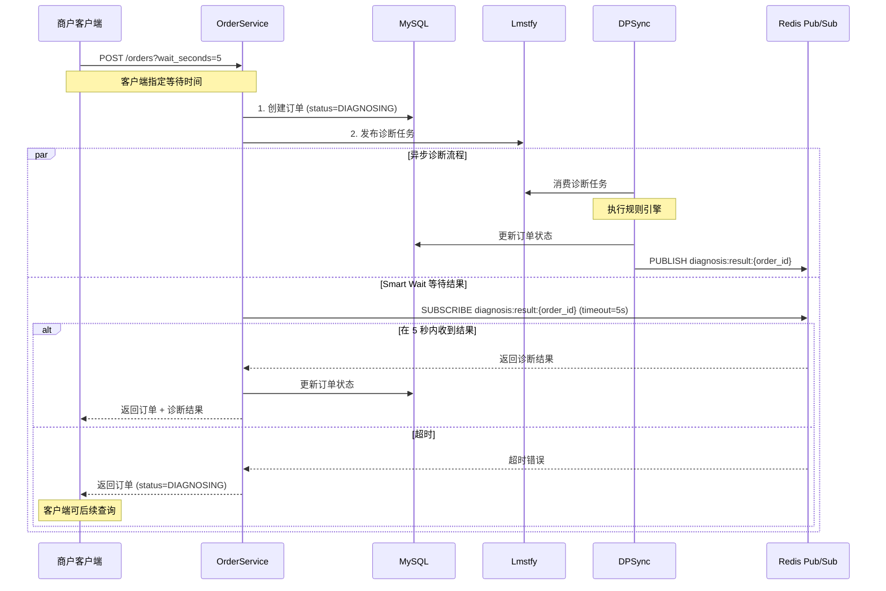
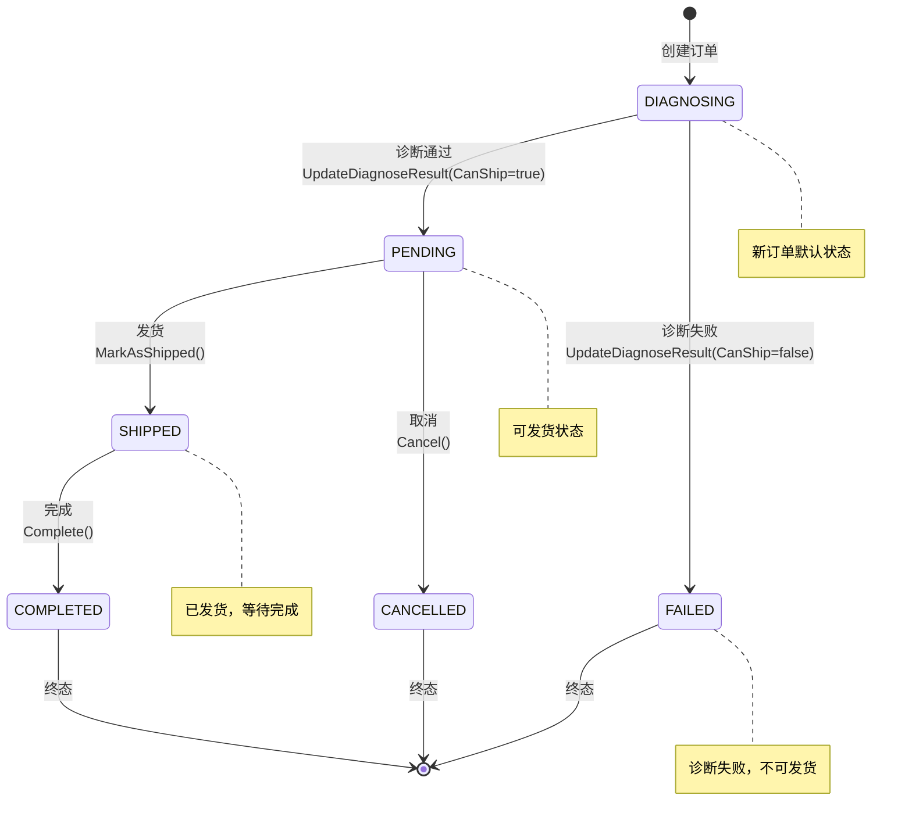

# DPMain 架构设计文档（第四部分）

## 目录
5. [关键技术决策](#5-关键技术决策)

---

## 5. 关键技术决策

### 5.1 Smart Wait 机制

#### 业务场景与挑战

**传统异步架构的用户体验问题：**
```
客户端 → API: 创建订单
API → 客户端: 返回 {order_id: "xxx", status: "DIAGNOSING"}
客户端: 需要轮询 API 查询诊断结果
  ├─ 第 1 次查询: status = "DIAGNOSING"
  ├─ 第 2 次查询: status = "DIAGNOSING"
  ├─ 第 3 次查询: status = "PENDING"  (终于完成)
```

**问题：**
1. **用户体验差**：需要等待多次轮询才能获取结果
2. **增加服务器负载**：大量轮询请求占用资源
3. **实现复杂**：客户端需要实现轮询逻辑和超时处理

#### Smart Wait 的设计思路

**核心理念：**
> 在异步架构的基础上，提供"伪同步"的用户体验。

**流程图：**


#### Smart Wait 的实现

**OrderService 中的实现：**
```go
func (s *OrderService) CreateOrder(ctx context.Context, accountID int64, merchantOrderNo string, shipment *etorder.Shipment, waitSeconds int) (*etorder.Order, error) {
    // 1-4: 创建订单并发布诊断任务（省略）
    order, err := etorder.NewOrder(uuid.New().String(), accountID, merchantOrderNo, shipment)
    s.orderModule.CreateOrder(ctx, order)
    s.diagnosisModule.PublishDiagnoseJob(ctx, order)

    // 5. Smart Wait（等待诊断结果）
    if waitSeconds > 0 {
        timeout := time.Duration(waitSeconds) * time.Second
        result, err := s.diagnosisModule.WaitForDiagnosisResult(ctx, order.ID, timeout)

        // 错误处理：超时或订阅失败
        if err != nil {
            log.Printf("[WARN] wait for diagnosis result failed: order_id=%s, error=%v", order.ID, err)
            return order, nil  // 返回 DIAGNOSING 状态的订单
        }

        // 成功获取结果
        if result != nil {
            // 更新内存中的 Order 实体
            if err := order.UpdateDiagnoseResult(result); err != nil {
                return nil, fmt.Errorf("update order entity failed: %w", err)
            }

            // 持久化到 DB
            if err := s.orderModule.UpdateDiagnoseResult(ctx, order.ID, result); err != nil {
                log.Printf("[ERROR] persist diagnose result failed: order_id=%s, error=%v", order.ID, err)
                return nil, fmt.Errorf("persist diagnose result failed: %w", err)
            }
        }
    }

    return order, nil
}
```

**DiagnosisModule 中的实现：**
```go
func (m *DiagnosisModule) WaitForDiagnosisResult(ctx context.Context, orderID string, timeout time.Duration) (*etorder.DiagnoseResult, error) {
    // 业务逻辑：频道命名规则
    channel := fmt.Sprintf("diagnosis:result:%s", orderID)

    // 调用基础设施层：订阅 Redis 频道
    payload, err := m.redisClient.Subscribe(ctx, channel, timeout)
    if err != nil {
        return nil, err  // 超时或订阅失败
    }

    // 业务逻辑：反序列化为领域对象
    var result etorder.DiagnoseResult
    if err := json.Unmarshal([]byte(payload), &result); err != nil {
        return nil, err
    }

    return &result, nil
}
```

**Redis PubSubClient 的实现：**
```go
// infra/persistence/redis/pubsub_client.go
type PubSubClient struct {
    client *redis.Client
}

func (c *PubSubClient) Subscribe(ctx context.Context, channel string, timeout time.Duration) (string, error) {
    pubsub := c.client.Subscribe(ctx, channel)
    defer pubsub.Close()

    // 创建超时上下文
    ctx, cancel := context.WithTimeout(ctx, timeout)
    defer cancel()

    // 等待消息
    msgChan := pubsub.Channel()
    select {
    case msg := <-msgChan:
        return msg.Payload, nil
    case <-ctx.Done():
        return "", fmt.Errorf("subscribe timeout after %v", timeout)
    }
}

func (c *PubSubClient) Publish(ctx context.Context, channel string, message interface{}) error {
    payload, err := json.Marshal(message)
    if err != nil {
        return fmt.Errorf("marshal message failed: %w", err)
    }

    return c.client.Publish(ctx, channel, payload).Err()
}
```

#### Smart Wait 的关键设计点

**设计点 1：超时时间由客户端指定**
```go
// API Handler 中解析超时参数
type CreateOrderRequest struct {
    AccountID       int64     `json:"account_id"`
    MerchantOrderNo string    `json:"merchant_order_no"`
    Shipment        *Shipment `json:"shipment"`
    WaitSeconds     int       `json:"wait_seconds"`  // 0 表示不等待，立即返回
}

func (h *OrderHandler) CreateOrder(c *gin.Context) {
    var req CreateOrderRequest
    if err := c.ShouldBindJSON(&req); err != nil {
        c.JSON(400, gin.H{"error": err.Error()})
        return
    }

    order, err := h.orderService.CreateOrder(c.Request.Context(), req.AccountID, req.MerchantOrderNo, req.Shipment, req.WaitSeconds)
    // ...
}
```

**为什么让客户端指定超时时间？**
- **灵活性**：不同场景对实时性的要求不同
  - 用户在页面创建订单：可以等待 5 秒
  - 批量导入订单：设置 `wait_seconds=0`，不等待
- **避免长时间阻塞**：服务器不会被超长的等待请求占用连接

**设计点 2：超时不是错误，是预期行为**
```go
// ✅ 超时时返回 DIAGNOSING 状态的订单，不返回 error
if err != nil {
    log.Printf("[WARN] wait for diagnosis result failed: order_id=%s, error=%v", order.ID, err)
    return order, nil  // 订单已创建成功，只是还没有诊断结果
}
```

**为什么超时不返回错误？**
- 订单已经成功创建并持久化，不应该认为是失败
- 客户端可以通过 `status=DIAGNOSING` 判断需要后续查询

**设计点 3：频道命名规则**
```go
// 业务逻辑：频道命名规则由 DiagnosisModule 定义
channel := fmt.Sprintf("diagnosis:result:%s", orderID)
```

**为什么将频道命名规则放在 DiagnosisModule？**
- 这是业务约定，属于领域层的职责
- DPSync 也需要知道这个命名规则（发布消息时）
- 如果未来需要修改规则（如加入租户隔离），只需修改 DiagnosisModule

#### Smart Wait 的性能优化

**优化 1：使用 Redis Pub/Sub 而非轮询**
```go
// ❌ 错误的做法：数据库轮询
for i := 0; i < waitSeconds; i++ {
    order, _ := s.orderModule.GetOrder(ctx, orderID)
    if order.Status != "DIAGNOSING" {
        return order, nil
    }
    time.Sleep(1 * time.Second)
}

// ✅ 正确的做法：Redis Pub/Sub
result, err := m.redisClient.Subscribe(ctx, channel, timeout)
```

**Redis Pub/Sub 的优势：**
- **事件驱动**：只在有结果时才返回，不浪费 CPU
- **低延迟**：毫秒级响应
- **不占用数据库连接**：避免长时间占用 MySQL 连接

**优化 2：避免 Goroutine 泄漏**
```go
func (c *PubSubClient) Subscribe(ctx context.Context, channel string, timeout time.Duration) (string, error) {
    pubsub := c.client.Subscribe(ctx, channel)
    defer pubsub.Close()  // ✅ 确保 pubsub 连接关闭

    ctx, cancel := context.WithTimeout(ctx, timeout)
    defer cancel()  // ✅ 确保 context 被取消

    msgChan := pubsub.Channel()
    select {
    case msg := <-msgChan:
        return msg.Payload, nil
    case <-ctx.Done():
        return "", fmt.Errorf("subscribe timeout after %v", timeout)
    }
}
```

### 5.2 错误处理策略

#### 错误分类：可恢复错误 vs 致命错误

**可恢复错误：**
- 队列发布失败（Lmstfy 暂时不可用）
- Redis 订阅超时（诊断引擎处理慢）
- 外部 API 调用失败（第三方服务暂时不可用）

**处理策略：**
1. 记录日志（便于监控告警）
2. 降级处理（返回部分结果或默认值）
3. 不阻断主流程

**致命错误：**
- 数据库连接失败
- 数据库写入失败
- 业务规则违反（如订单重复）

**处理策略：**
1. 立即返回错误给调用方
2. 使用 `%w` 包装错误，保留错误链
3. 事务回滚（如果在事务中）

#### 错误处理的实战案例

**案例 1：发布诊断任务失败（可恢复错误）**
```go
// 发布到诊断队列
if err := s.diagnosisModule.PublishDiagnoseJob(ctx, order); err != nil {
    // ✅ 记录日志，但不阻断流程
    log.Printf("[WARN] publish diagnose job failed: order_id=%s, error=%v", order.ID, err)
    // 订单已创建成功，发布失败不影响订单持久化
    // 可以通过重试机制或手动触发诊断
}
```

**为什么不返回错误？**
- 订单已经持久化到数据库，不应该认为是失败
- 诊断任务可以通过其他方式触发（如定时任务、手动重试）

**监控告警：**
- 统计发布失败的频率
- 如果失败率 > 5%，触发告警

**案例 2：Smart Wait 超时（可恢复错误）**
```go
result, err := s.diagnosisModule.WaitForDiagnosisResult(ctx, order.ID, timeout)
if err != nil {
    // ✅ 记录日志，但不返回错误
    log.Printf("[WARN] wait for diagnosis result failed: order_id=%s, error=%v", order.ID, err)
    return order, nil  // 返回 DIAGNOSING 状态的订单
}
```

**为什么不返回错误？**
- 超时是预期行为（诊断可能需要 10 秒，但客户端只愿意等 5 秒）
- 客户端可以通过 `status=DIAGNOSING` 判断需要后续查询

**案例 3：更新诊断结果失败（致命错误）**
```go
if result != nil {
    // 更新内存中的 Order 实体
    if err := order.UpdateDiagnoseResult(result); err != nil {
        // ✅ 致命错误：内存状态不一致
        return nil, fmt.Errorf("update order entity failed: %w", err)
    }

    // 持久化到 DB
    if err := s.orderModule.UpdateDiagnoseResult(ctx, order.ID, result); err != nil {
        // ✅ 致命错误：内存已更新，但 DB 更新失败，数据不一致
        log.Printf("[ERROR] persist diagnose result failed: order_id=%s, error=%v", order.ID, err)
        return nil, fmt.Errorf("persist diagnose result failed: %w", err)
    }
}
```

**为什么必须返回错误？**
- 如果内存更新成功但 DB 更新失败，会导致数据不一致
- 这种情况需要返回错误，让客户端重试

#### Go 错误处理的最佳实践

**实践 1：使用 `%w` 包装错误**
```go
// ❌ 错误的做法：丢失错误上下文
if err := s.orderModule.CreateOrder(ctx, order); err != nil {
    return nil, errors.New("save order failed")  // 丢失了原始错误
}

// ✅ 正确的做法：使用 %w 包装错误
if err := s.orderModule.CreateOrder(ctx, order); err != nil {
    return nil, fmt.Errorf("save order failed: %w", err)  // 保留错误链
}
```

**好处：**
- 调用方可以使用 `errors.Is()` 判断错误类型
- 可以使用 `errors.Unwrap()` 获取原始错误

**实践 2：使用哨兵错误 (Sentinel Error)**
```go
// domains/entity/etorder/errors.go
var (
    ErrInvalidStatus = errors.New("invalid order status")
    ErrOrderNotFound = errors.New("order not found")
)

// Order 实体中使用哨兵错误
func (o *Order) UpdateDiagnoseResult(result *DiagnoseResult) error {
    if o.status != OrderStatusDiagnosing {
        return fmt.Errorf("%w: current status is %s", ErrInvalidStatus, o.status)
    }
    // ...
}

// 调用方可以判断错误类型
order, err := service.CreateOrder(...)
if errors.Is(err, etorder.ErrInvalidStatus) {
    // 业务规则错误，返回 400
    c.JSON(400, gin.H{"error": "invalid order status"})
} else {
    // 系统错误，返回 500
    c.JSON(500, gin.H{"error": "internal server error"})
}
```

**实践 3：区分日志级别**
```go
// [WARN] 可恢复错误
log.Printf("[WARN] publish diagnose job failed: order_id=%s, error=%v", order.ID, err)

// [ERROR] 致命错误
log.Printf("[ERROR] persist diagnose result failed: order_id=%s, error=%v", order.ID, err)

// [INFO] 正常信息
log.Printf("[INFO] order created successfully: order_id=%s", order.ID)
```

**监控告警规则：**
- `[ERROR]` 日志：立即触发告警
- `[WARN]` 日志：统计频率，超过阈值时告警

### 5.3 消息自包含设计

#### 问题：DPSync 如何获取订单信息？

**方案 1：DPSync 查询 DPMain 的数据库**
```go
// DPSync 消费诊断任务
func (s *DiagnosisEngine) Process(job OrderDiagnoseJob) {
    orderID := job.Payload.Data.OrderID

    // ❌ DPSync 查询 DPMain 的数据库
    var order Order
    s.db.First(&order, "id = ?", orderID)

    // 执行诊断逻辑
    result := s.diagnose(order.Shipment)
}
```

**问题：**
1. **耦合性强**：DPSync 依赖 DPMain 的数据库结构
2. **性能问题**：每个诊断任务都需要查询数据库
3. **数据一致性**：查询时订单可能已被修改

**方案 2：DPSync 调用 DPMain 的 API**
```go
// DPSync 消费诊断任务
func (s *DiagnosisEngine) Process(job OrderDiagnoseJob) {
    orderID := job.Payload.Data.OrderID

    // ❌ DPSync 调用 DPMain 的 API
    order, err := s.apiClient.GetOrder(orderID)
    if err != nil {
        return err
    }

    // 执行诊断逻辑
    result := s.diagnose(order.Shipment)
}
```

**问题：**
1. **性能问题**：HTTP 调用延迟高
2. **可用性问题**：DPMain API 故障会影响 DPSync
3. **循环依赖**：DPSync 依赖 DPMain，DPMain 依赖 DPSync

**方案 3：消息自包含（DPMain 的选择）**
```go
// DPMain 发布诊断任务时，包含完整的 Shipment 数据
func (m *DiagnosisModule) PublishDiagnoseJob(ctx context.Context, order *etorder.Order) error {
    // 将 Shipment 转换为 map 格式
    var shipmentMap map[string]interface{}
    shipmentJSON, _ := json.Marshal(order.Shipment)
    json.Unmarshal(shipmentJSON, &shipmentMap)

    message := model.OrderDiagnoseJob{
        Payload: model.OrderDiagnosePayload{
            Data: model.OrderDiagnoseData{
                RequestID:       uuid.New().String(),
                OrderID:         order.ID,
                AccountID:       order.AccountID,
                MerchantOrderNo: order.MerchantOrderNo,
                Shipment:        shipmentMap,  // ✅ 完整的货件信息
            },
        },
    }

    return m.lmstfyClient.Publish(ctx, m.queueName, message)
}

// DPSync 消费诊断任务
func (s *DiagnosisEngine) Process(job OrderDiagnoseJob) {
    // ✅ 直接从消息中获取 Shipment，无需查询数据库
    shipment := job.Payload.Data.Shipment

    // 执行诊断逻辑
    result := s.diagnose(shipment)
}
```

**优势：**
1. **服务解耦**：DPSync 无需访问 DPMain 的数据库或 API
2. **性能优化**：避免额外的数据库查询或 HTTP 调用
3. **数据一致性**：诊断基于订单创建时的快照，不会受后续修改影响

#### 消息自包含的权衡

**优点：**
- 服务解耦，提高系统可用性
- 减少网络调用，提高性能
- 数据一致性（基于快照）

**缺点：**
- 消息体积变大（包含完整的 Shipment 数据）
- 如果 Shipment 数据量很大，可能影响队列性能

**适用场景：**
- 消息数据量适中（DPMain 的 Shipment 通常 < 10 KB）
- 服务间解耦比消息体积更重要
- 诊断逻辑需要订单的快照，而非实时数据

**不适用场景：**
- 消息数据量巨大（如包含大文件）
- 需要实时数据（如库存扣减需要查询最新库存）

### 5.4 订单状态机设计

#### 状态转换规则



#### Order 实体中的状态转换方法

```go
// domains/entity/etorder/order.go
type OrderStatus string

const (
    OrderStatusDiagnosing OrderStatus = "DIAGNOSING"  // 诊断中
    OrderStatusPending    OrderStatus = "PENDING"     // 待发货
    OrderStatusFailed     OrderStatus = "FAILED"      // 诊断失败
    OrderStatusShipped    OrderStatus = "SHIPPED"     // 已发货
    OrderStatusCompleted  OrderStatus = "COMPLETED"   // 已完成
    OrderStatusCancelled  OrderStatus = "CANCELLED"   // 已取消
)

type Order struct {
    id              string
    accountID       int64
    merchantOrderNo string
    status          OrderStatus
    shipment        *Shipment
    diagnoseResult  *DiagnoseResult
    createdAt       time.Time
    updatedAt       time.Time
}

// UpdateDiagnoseResult 更新诊断结果（DIAGNOSING → PENDING/FAILED）
func (o *Order) UpdateDiagnoseResult(result *DiagnoseResult) error {
    // 业务规则：只有 DIAGNOSING 状态才能更新诊断结果
    if o.status != OrderStatusDiagnosing {
        return fmt.Errorf("%w: cannot update diagnose result for order in status %s", ErrInvalidStatus, o.status)
    }

    o.diagnoseResult = result

    // 业务规则：根据诊断结果自动转换状态
    if result.CanShip {
        o.status = OrderStatusPending
    } else {
        o.status = OrderStatusFailed
    }

    o.updatedAt = time.Now()
    return nil
}

// MarkAsShipped 标记为已发货（PENDING → SHIPPED）
func (o *Order) MarkAsShipped() error {
    // 业务规则：只有 PENDING 状态才能发货
    if o.status != OrderStatusPending {
        return fmt.Errorf("%w: cannot ship order in status %s", ErrInvalidStatus, o.status)
    }

    o.status = OrderStatusShipped
    o.updatedAt = time.Now()
    return nil
}

// Complete 标记为已完成（SHIPPED → COMPLETED）
func (o *Order) Complete() error {
    // 业务规则：只有 SHIPPED 状态才能完成
    if o.status != OrderStatusShipped {
        return fmt.Errorf("%w: cannot complete order in status %s", ErrInvalidStatus, o.status)
    }

    o.status = OrderStatusCompleted
    o.updatedAt = time.Now()
    return nil
}

// Cancel 取消订单（PENDING → CANCELLED）
func (o *Order) Cancel() error {
    // 业务规则：只有 PENDING 状态才能取消
    if o.status != OrderStatusPending {
        return fmt.Errorf("%w: cannot cancel order in status %s", ErrInvalidStatus, o.status)
    }

    o.status = OrderStatusCancelled
    o.updatedAt = time.Now()
    return nil
}
```

#### 为什么将状态转换封装在实体中？

**优势 1：保证状态转换的合法性**
```go
// ❌ 如果不封装，Service 层可能出现非法状态转换
func (s *OrderService) ShipOrder(orderID string) error {
    order, _ := s.orderModule.GetOrder(ctx, orderID)

    // 忘记检查状态，直接更新
    order.Status = "SHIPPED"  // 可能从 FAILED 转换到 SHIPPED（非法）
    s.orderModule.UpdateOrder(ctx, order)
}

// ✅ 封装后，非法转换会被实体拒绝
func (s *OrderService) ShipOrder(orderID string) error {
    order, _ := s.orderModule.GetOrder(ctx, orderID)

    if err := order.MarkAsShipped(); err != nil {
        return err  // 如果当前状态不是 PENDING，返回错误
    }

    s.orderModule.UpdateOrder(ctx, order)
}
```

**优势 2：业务规则集中管理**
- 所有状态转换规则都在 `Order` 实体中
- 修改规则时，只需修改一处代码
- 新人可以快速理解订单的生命周期

**优势 3：易于测试**
```go
func TestOrder_MarkAsShipped(t *testing.T) {
    order := &Order{
        id:     "order-123",
        status: OrderStatusPending,
    }

    // ✅ 测试合法转换
    err := order.MarkAsShipped()
    assert.NoError(t, err)
    assert.Equal(t, OrderStatusShipped, order.status)

    // ✅ 测试非法转换
    err = order.MarkAsShipped()  // 从 SHIPPED 再次调用
    assert.Error(t, err)
    assert.True(t, errors.Is(err, ErrInvalidStatus))
}
```

### 5.5 性能优化策略

#### 优化 1：数据库连接池配置

```go
func ProvideDB(cfg *config.Config) (*gorm.DB, func(), error) {
    db, err := gorm.Open(mysql.Open(cfg.MySQL.DSN), &gorm.Config{})
    if err != nil {
        return nil, nil, err
    }

    sqlDB, err := db.DB()
    if err != nil {
        return nil, nil, err
    }

    // ✅ 配置连接池参数
    sqlDB.SetMaxIdleConns(10)           // 最大空闲连接数
    sqlDB.SetMaxOpenConns(100)          // 最大打开连接数
    sqlDB.SetConnMaxLifetime(time.Hour) // 连接最大生命周期

    // 测试连接
    if err := sqlDB.Ping(); err != nil {
        return nil, nil, err
    }

    cleanup := func() {
        if sqlDB != nil {
            sqlDB.Close()
        }
    }

    return db, cleanup, nil
}
```

**参数说明：**
- `MaxIdleConns=10`：保持 10 个空闲连接，快速响应突发请求
- `MaxOpenConns=100`：最大 100 个连接，避免压垮数据库
- `ConnMaxLifetime=1h`：每小时轮换连接，避免长连接问题

#### 优化 2：数据库索引设计

```sql
-- 订单表索引
CREATE TABLE orders (
    id VARCHAR(64) PRIMARY KEY,
    account_id BIGINT NOT NULL,
    merchant_order_no VARCHAR(128) NOT NULL,
    status VARCHAR(32) NOT NULL,
    created_at TIMESTAMP NOT NULL,
    updated_at TIMESTAMP NOT NULL,

    -- ✅ 组合索引：用于检查订单重复
    INDEX idx_account_merchant_no (account_id, merchant_order_no),

    -- ✅ 索引：用于查询账号的订单列表
    INDEX idx_account_created (account_id, created_at DESC)
);
```

**索引设计原则：**
1. **高频查询必须有索引**：`GetByAccountAndMerchantNo` 查询使用 `idx_account_merchant_no`
2. **覆盖索引优化**：`(account_id, created_at)` 可以直接返回结果，无需回表
3. **避免过多索引**：每个索引都会增加写入成本，权衡查询和写入性能

#### 优化 3：Redis 连接池配置

```go
func ProvideRedisClient(cfg *config.Config) (*redis.PubSubClient, func(), error) {
    client := redis.NewClient(&redis.Options{
        Addr:     cfg.Redis.Addr,
        Password: cfg.Redis.Password,
        DB:       cfg.Redis.DB,

        // ✅ 连接池配置
        PoolSize:     100,              // 连接池大小
        MinIdleConns: 10,               // 最小空闲连接数
        PoolTimeout:  30 * time.Second, // 获取连接超时
    })

    // 测试连接
    if err := client.Ping(context.Background()).Err(); err != nil {
        return nil, nil, err
    }

    pubsubClient := &redis.PubSubClient{client: client}

    cleanup := func() {
        client.Close()
    }

    return pubsubClient, cleanup, nil
}
```

#### 优化 4：避免 N+1 查询

```go
// ❌ N+1 查询问题
func (s *OrderService) ListOrders(ctx context.Context, accountID int64, page, limit int) ([]*OrderResponse, error) {
    orders, _ := s.orderModule.ListOrders(ctx, accountID, page, limit)

    var responses []*OrderResponse
    for _, order := range orders {
        // 每个订单都查询一次账号信息（N 次查询）
        account, _ := s.accountModule.GetAccount(ctx, order.AccountID)
        responses = append(responses, &OrderResponse{
            Order:       order,
            AccountName: account.Name,
        })
    }

    return responses, nil
}

// ✅ 批量查询优化
func (s *OrderService) ListOrders(ctx context.Context, accountID int64, page, limit int) ([]*OrderResponse, error) {
    orders, _ := s.orderModule.ListOrders(ctx, accountID, page, limit)

    // 收集所有 account_id
    accountIDs := make([]int64, 0, len(orders))
    for _, order := range orders {
        accountIDs = append(accountIDs, order.AccountID)
    }

    // 批量查询账号信息（1 次查询）
    accounts, _ := s.accountModule.GetAccountsByIDs(ctx, accountIDs)
    accountMap := make(map[int64]*Account)
    for _, account := range accounts {
        accountMap[account.ID] = account
    }

    // 组装响应
    var responses []*OrderResponse
    for _, order := range orders {
        responses = append(responses, &OrderResponse{
            Order:       order,
            AccountName: accountMap[order.AccountID].Name,
        })
    }

    return responses, nil
}
```

---

## 下一部分预告

在 [第五部分：扩展性设计与面试准备](./05_extensibility_and_interview.md) 中，我们将深入探讨：
- 如何切换数据库（MySQL → PostgreSQL）
- 如何添加监控和链路追踪（Prometheus、Jaeger）
- 如何支持分布式部署（多实例、负载均衡）
- 面试准备：STAR 方法讲述项目亮点
- 性能压测：使用 k6 进行压力测试
