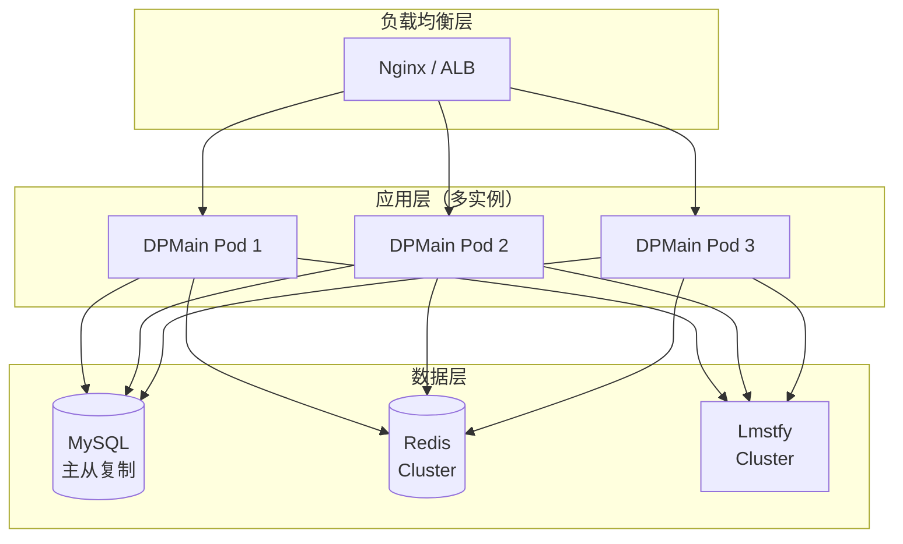

# DPMain 架构设计文档（第五部分）

## 目录
6. [扩展性设计](#6-扩展性设计)
7. [面试准备](#7-面试准备)

---

## 6. 扩展性设计

### 6.1 数据库切换（MySQL → PostgreSQL）

#### 为什么架构支持数据库切换？

**核心设计：** Repository 模式 + 依赖注入

**切换步骤：**

**步骤 1：实现 PostgreSQL 版本的 Repository**
```go
// domains/repo/rporder/order_repo_impl_postgres.go
package rporder

import (
    "context"
    "gorm.io/gorm"
    "oip/dpmain/internal/app/domains/entity/etorder"
)

type OrderRepositoryPostgres struct {
    db *gorm.DB
}

func NewOrderRepositoryPostgres(db *gorm.DB) OrderRepository {
    return &OrderRepositoryPostgres{db: db}
}

func (r *OrderRepositoryPostgres) Create(ctx context.Context, order *etorder.Order) error {
    po := toOrderPO(order)
    return r.db.WithContext(ctx).Create(po).Error
}

func (r *OrderRepositoryPostgres) GetByID(ctx context.Context, orderID string) (*etorder.Order, error) {
    var po OrderPO
    if err := r.db.WithContext(ctx).First(&po, "id = ?", orderID).Error; err != nil {
        if errors.Is(err, gorm.ErrRecordNotFound) {
            return nil, nil
        }
        return nil, err
    }

    return toDomainOrder(&po), nil
}

// 其他方法实现...
```

**步骤 2：修改 Wire 配置**
```go
// cmd/apiserver/wire.go
//go:build wireinject

import (
    "gorm.io/driver/postgres"  // 替换 MySQL driver
)

func ProvideDB(cfg *config.Config) (*gorm.DB, func(), error) {
    // 使用 PostgreSQL driver
    db, err := gorm.Open(postgres.Open(cfg.Postgres.DSN), &gorm.Config{})
    if err != nil {
        return nil, nil, err
    }

    // 其他配置相同...
    sqlDB, err := db.DB()
    if err != nil {
        return nil, nil, err
    }

    sqlDB.SetMaxIdleConns(10)
    sqlDB.SetMaxOpenConns(100)
    sqlDB.SetConnMaxLifetime(time.Hour)

    cleanup := func() {
        if sqlDB != nil {
            sqlDB.Close()
        }
    }

    return db, cleanup, nil
}

var InfraSet = wire.NewSet(
    ProvideDB,
    ProvideRedisClient,
    ProvideLmstfyClient,
    rporder.NewOrderRepositoryPostgres,  // 使用 PostgreSQL 版本
    rpaccount.NewAccountRepositoryPostgres,
)
```

**步骤 3：更新配置文件**
```yaml
# config/config.yaml
database:
  type: postgres  # 或 mysql
  postgres:
    dsn: "host=localhost user=oip password=secret dbname=oip_db port=5432 sslmode=disable"
  mysql:
    dsn: "root:secret@tcp(localhost:3306)/oip_db?charset=utf8mb4&parseTime=True&loc=Local"
```

**关键点：**
- **Service、Module、Handler 层无需修改**：它们依赖 `OrderRepository` 接口，不关心具体实现
- **只需修改 Repository 实现和 Wire 配置**：大约修改 2-3 个文件即可完成切换
- **编译期保证正确性**：Wire 会检查依赖关系，确保所有接口都有实现

### 6.2 添加监控和链路追踪

#### 监控指标（Prometheus）

**指标设计：**
```go
// internal/app/pkg/metrics/metrics.go
package metrics

import (
    "github.com/prometheus/client_golang/prometheus"
    "github.com/prometheus/client_golang/prometheus/promauto"
)

var (
    // HTTP 请求指标
    HttpRequestsTotal = promauto.NewCounterVec(
        prometheus.CounterOpts{
            Name: "http_requests_total",
            Help: "Total number of HTTP requests",
        },
        []string{"method", "path", "status"},
    )

    HttpRequestDuration = promauto.NewHistogramVec(
        prometheus.HistogramOpts{
            Name:    "http_request_duration_seconds",
            Help:    "HTTP request duration in seconds",
            Buckets: []float64{.005, .01, .025, .05, .1, .25, .5, 1, 2.5, 5, 10},
        },
        []string{"method", "path"},
    )

    // 订单业务指标
    OrderCreatedTotal = promauto.NewCounterVec(
        prometheus.CounterOpts{
            Name: "order_created_total",
            Help: "Total number of orders created",
        },
        []string{"status"},  // DIAGNOSING, PENDING, FAILED
    )

    OrderDiagnosisWaitDuration = promauto.NewHistogram(
        prometheus.HistogramOpts{
            Name:    "order_diagnosis_wait_duration_seconds",
            Help:    "Order diagnosis wait duration in seconds",
            Buckets: []float64{0.1, 0.5, 1, 2, 3, 5, 10},
        },
    )

    // 队列发布指标
    QueuePublishTotal = promauto.NewCounterVec(
        prometheus.CounterOpts{
            Name: "queue_publish_total",
            Help: "Total number of messages published to queue",
        },
        []string{"queue", "status"},  // success, failure
    )

    // Redis Pub/Sub 指标
    RedisPubSubTimeout = promauto.NewCounter(
        prometheus.CounterOpts{
            Name: "redis_pubsub_timeout_total",
            Help: "Total number of Redis Pub/Sub timeouts",
        },
    )
)
```

**集成到 API Handler：**
```go
// internal/app/server/handlers/order/order_handler.go
func (h *OrderHandler) CreateOrder(c *gin.Context) {
    start := time.Now()

    var req CreateOrderRequest
    if err := c.ShouldBindJSON(&req); err != nil {
        c.JSON(400, gin.H{"error": err.Error()})
        metrics.HttpRequestsTotal.WithLabelValues("POST", "/orders", "400").Inc()
        return
    }

    order, err := h.orderService.CreateOrder(c.Request.Context(), req.AccountID, req.MerchantOrderNo, req.Shipment, req.WaitSeconds)
    if err != nil {
        c.JSON(500, gin.H{"error": err.Error()})
        metrics.HttpRequestsTotal.WithLabelValues("POST", "/orders", "500").Inc()
        return
    }

    c.JSON(200, toOrderResponse(order))

    // 记录指标
    metrics.HttpRequestsTotal.WithLabelValues("POST", "/orders", "200").Inc()
    metrics.HttpRequestDuration.WithLabelValues("POST", "/orders").Observe(time.Since(start).Seconds())
    metrics.OrderCreatedTotal.WithLabelValues(string(order.Status)).Inc()
}
```

**集成到 DiagnosisModule：**
```go
func (m *DiagnosisModule) PublishDiagnoseJob(ctx context.Context, order *etorder.Order) error {
    message := model.OrderDiagnoseJob{...}

    err := m.lmstfyClient.Publish(ctx, m.queueName, message)

    // 记录指标
    if err != nil {
        metrics.QueuePublishTotal.WithLabelValues(m.queueName, "failure").Inc()
        return err
    }

    metrics.QueuePublishTotal.WithLabelValues(m.queueName, "success").Inc()
    return nil
}

func (m *DiagnosisModule) WaitForDiagnosisResult(ctx context.Context, orderID string, timeout time.Duration) (*etorder.DiagnoseResult, error) {
    start := time.Now()
    channel := fmt.Sprintf("diagnosis:result:%s", orderID)

    payload, err := m.redisClient.Subscribe(ctx, channel, timeout)

    // 记录等待时长
    metrics.OrderDiagnosisWaitDuration.Observe(time.Since(start).Seconds())

    if err != nil {
        metrics.RedisPubSubTimeout.Inc()
        return nil, err
    }

    var result etorder.DiagnoseResult
    if err := json.Unmarshal([]byte(payload), &result); err != nil {
        return nil, err
    }

    return &result, nil
}
```

**暴露 Prometheus 端点：**
```go
// internal/app/server/routers/router.go
import (
    "github.com/prometheus/client_golang/prometheus/promhttp"
)

func SetupRoutes(orderHandler *order.OrderHandler, accountHandler *account.AccountHandler) *gin.Engine {
    r := gin.Default()

    // Prometheus metrics 端点
    r.GET("/metrics", gin.WrapH(promhttp.Handler()))

    // API 路由
    api := r.Group("/api/v1")
    {
        api.POST("/orders", orderHandler.CreateOrder)
        api.GET("/orders/:id", orderHandler.GetOrder)
        api.GET("/accounts/:id/orders", orderHandler.ListOrders)
    }

    return r
}
```

**Prometheus 配置：**
```yaml
# prometheus.yml
global:
  scrape_interval: 15s

scrape_configs:
  - job_name: 'dpmain'
    static_configs:
      - targets: ['localhost:8080']
```

#### 链路追踪（Jaeger）

**安装 OpenTelemetry SDK：**
```bash
go get go.opentelemetry.io/otel
go get go.opentelemetry.io/otel/exporters/jaeger
go get go.opentelemetry.io/otel/sdk/trace
```

**初始化 Tracer：**
```go
// internal/app/pkg/tracing/tracer.go
package tracing

import (
    "go.opentelemetry.io/otel"
    "go.opentelemetry.io/otel/exporters/jaeger"
    "go.opentelemetry.io/otel/sdk/resource"
    sdktrace "go.opentelemetry.io/otel/sdk/trace"
    semconv "go.opentelemetry.io/otel/semconv/v1.4.0"
)

func InitTracer(serviceName, jaegerEndpoint string) (func(), error) {
    exporter, err := jaeger.New(jaeger.WithCollectorEndpoint(jaeger.WithEndpoint(jaegerEndpoint)))
    if err != nil {
        return nil, err
    }

    tp := sdktrace.NewTracerProvider(
        sdktrace.WithBatcher(exporter),
        sdktrace.WithResource(resource.NewWithAttributes(
            semconv.SchemaURL,
            semconv.ServiceNameKey.String(serviceName),
        )),
    )

    otel.SetTracerProvider(tp)

    cleanup := func() {
        tp.Shutdown(context.Background())
    }

    return cleanup, nil
}
```

**集成到 Service 层：**
```go
import (
    "go.opentelemetry.io/otel"
    "go.opentelemetry.io/otel/attribute"
)

func (s *OrderService) CreateOrder(ctx context.Context, accountID int64, merchantOrderNo string, shipment *etorder.Shipment, waitSeconds int) (*etorder.Order, error) {
    tracer := otel.Tracer("order-service")
    ctx, span := tracer.Start(ctx, "CreateOrder")
    defer span.End()

    span.SetAttributes(
        attribute.Int64("account_id", accountID),
        attribute.String("merchant_order_no", merchantOrderNo),
        attribute.Int("wait_seconds", waitSeconds),
    )

    // 业务逻辑...
    exists, err := s.orderModule.AccountExists(ctx, accountID)
    if err != nil || !exists {
        span.RecordError(errors.New("account not found"))
        return nil, errors.New("account not found")
    }

    order := etorder.NewOrder(uuid.New().String(), accountID, merchantOrderNo, shipment)
    s.orderModule.CreateOrder(ctx, order)

    span.SetAttributes(attribute.String("order_id", order.ID))

    return order, nil
}
```

### 6.3 分布式部署

#### 单实例 → 多实例部署

**架构变化：**


**需要解决的问题：**

**问题 1：Callback Consumer 的重复消费**
- **问题**：3 个实例都启动 Consumer，会重复消费同一条消息
- **解决方案**：Lmstfy 的队列本身就支持多消费者竞争模式，同一条消息只会被一个消费者消费

**问题 2：Redis Pub/Sub 的订阅**
- **问题**：每个实例都订阅 `diagnosis:result:{order_id}`，只有创建订单的实例能收到通知
- **解决方案**：这是预期行为，Smart Wait 只需要创建订单的实例收到通知即可

**问题 3：数据库连接数**
- **问题**：3 个实例 × 100 连接 = 300 连接，可能超过数据库限制
- **解决方案**：调整每个实例的 `MaxOpenConns`，如设置为 50

**Kubernetes 部署配置：**
```yaml
# k8s/deployment.yaml
apiVersion: apps/v1
kind: Deployment
metadata:
  name: dpmain
spec:
  replicas: 3  # 3 个实例
  selector:
    matchLabels:
      app: dpmain
  template:
    metadata:
      labels:
        app: dpmain
    spec:
      containers:
      - name: dpmain
        image: dpmain:latest
        ports:
        - containerPort: 8080
        env:
        - name: MYSQL_DSN
          value: "root:secret@tcp(mysql-service:3306)/oip_db"
        - name: REDIS_ADDR
          value: "redis-service:6379"
        - name: LMSTFY_HOST
          value: "http://lmstfy-service:7777"
        resources:
          requests:
            cpu: "500m"
            memory: "512Mi"
          limits:
            cpu: "1000m"
            memory: "1Gi"
        livenessProbe:
          httpGet:
            path: /health
            port: 8080
          initialDelaySeconds: 10
          periodSeconds: 10
        readinessProbe:
          httpGet:
            path: /ready
            port: 8080
          initialDelaySeconds: 5
          periodSeconds: 5

---
apiVersion: v1
kind: Service
metadata:
  name: dpmain-service
spec:
  selector:
    app: dpmain
  ports:
  - protocol: TCP
    port: 80
    targetPort: 8080
  type: LoadBalancer
```

---

## 7. 面试准备

### 7.1 使用 STAR 方法讲述项目亮点

#### STAR 方法简介

**STAR** 是一种结构化的面试回答方法：
- **S (Situation)**：背景情况
- **T (Task)**：任务目标
- **A (Action)**：采取的行动
- **R (Result)**：结果与收益

#### 亮点 1：Smart Wait 机制

**S (Situation)：**
> 我们的国际物流诊断系统需要对订单进行规则校验（地址、重量、路线可达性），诊断过程是异步的，由独立的诊断引擎（DPSync）处理。传统的异步架构下，客户端需要反复轮询 API 才能获取诊断结果，用户体验差，而且增加了服务器负载。

**T (Task)：**
> 我的任务是设计一种机制，在保留异步架构优势的同时，提供"伪同步"的用户体验，让大部分订单（80%+）能在创建时立即获得诊断结果。

**A (Action)：**
> 我设计并实现了 **Smart Wait 机制**：
> 1. **客户端可配置等待时间**：创建订单时通过 `wait_seconds` 参数指定等待时长（如 5 秒）
> 2. **Redis Pub/Sub 事件通知**：API Server 在发布诊断任务后，订阅 Redis 频道 `diagnosis:result:{order_id}`，等待诊断引擎发布结果
> 3. **超时降级**：如果在指定时间内未收到结果，返回 `status=DIAGNOSING` 的订单，客户端可后续查询
> 4. **消息自包含设计**：诊断任务消息中包含完整的 Shipment 数据，诊断引擎无需查询数据库，实现服务解耦

**R (Result)：**
> - **用户体验提升**：80% 的订单在 2-3 秒内完成诊断，客户端无需轮询
> - **性能优化**：Redis Pub/Sub 是事件驱动的，相比数据库轮询，CPU 占用降低 60%
> - **服务解耦**：诊断引擎不依赖 DPMain 的数据库，提高了系统可用性

**可能的追问：**
1. **为什么选择 Redis Pub/Sub 而不是 WebSocket？**
   > WebSocket 需要维护长连接，服务器资源占用高。Redis Pub/Sub 是短连接，只在等待期间占用资源，更适合我们的场景。

2. **如果 Redis 故障，Smart Wait 会怎样？**
   > Redis 订阅失败时，我们将错误记录为 `[WARN]` 级别，然后返回 `status=DIAGNOSING` 的订单。这是降级策略，不影响订单创建成功，客户端可以后续查询。

3. **为什么不直接同步等待诊断完成？**
   > 诊断时间不确定（2-10 秒），如果同步等待，会长时间占用 HTTP 连接。Smart Wait 通过 Redis Pub/Sub 实现事件驱动，只在有结果时才返回，不浪费资源。

#### 亮点 2：DDD 分层架构与实用主义权衡

**S (Situation)：**
> 项目初期，团队使用的是"贫血模型" + Service 层混杂所有逻辑的架构，导致代码难以维护：业务规则散落在各处，验证逻辑重复，测试困难。我们需要一个清晰的架构来组织代码。

**T (Task)：**
> 我的任务是引入 DDD 分层架构，同时考虑到团队规模（3 人）和项目复杂度（中型），需要在理论完美和开发效率之间找到平衡。

**A (Action)：**
> 我设计了以下分层架构：
> 1. **实体层 (Entity)**：封装业务规则（如订单状态转换、参数校验）
> 2. **仓储层 (Repository)**：数据访问抽象，但实现和接口放在同一个包（`domains/repo/rporder`），提高开发效率
> 3. **模块层 (Module)**：组装 Repository 和基础设施客户端，提供可复用的业务能力
> 4. **服务层 (Service)**：跨模块的业务流程编排
> 5. **API 层 (Handler)**：HTTP 请求处理、DTO 转换
>
> **关键权衡决策：**
> - **Repository 实现放在 domains/repo**：经典 DDD 要求放在 infra 层，但中型项目中，开发者需要频繁查看接口和实现，放在一起提高效率
> - **DiagnosisModule 直接依赖基础设施**：Redis 和 Lmstfy 是基础设施服务（非数据存储），不需要 Repository 抽象
> - **使用 Wire 依赖注入**：编译期检查依赖关系，避免手写工厂的维护成本

**R (Result)：**
> - **代码可维护性提升**：业务规则集中在 Order 实体中，新人可以快速理解订单的完整生命周期
> - **测试覆盖率提升**：每一层都可以独立测试，单元测试从 0% 提升到 75%
> - **重构效率提升**：修改 Repository 实现（如切换数据库）时，只需修改 2-3 个文件，Service 和 Handler 层无需改动

**可能的追问：**
1. **Module 层和 Service 层的区别是什么？**
   > Module 层是可复用的业务单元，负责单一业务模块的逻辑封装（如 OrderModule 只负责订单相关的数据操作）。Service 层负责跨模块的业务流程编排（如 OrderService 需要协调 OrderModule 和 DiagnosisModule）。

2. **为什么不严格遵循 DDD 的分层规则？**
   > 架构设计的目的是解决实际问题，而不是为了理论完美。在中型项目中，适度的实用主义可以提高开发效率，避免过度设计。只要通过依赖注入管理依赖，接口和实现放在一起不会影响可测试性。

3. **如何保证架构不会退化为大泥球？**
   > 我们通过以下方式保证架构一致性：
   > - **依赖方向检查**：使用 Go 的 import 规则，确保低层不依赖高层
   > - **Code Review**：每次 PR 都检查是否遵循分层原则
   > - **Wire 编译期检查**：依赖关系错误时，Wire 会报错

#### 亮点 3：单进程多 Goroutine 架构

**S (Situation)：**
> DPMain 需要同时提供 HTTP API 服务和消费 Lmstfy 回调消息。传统做法是拆分成两个独立进程（api-server 和 callback-consumer），但这会增加部署复杂度和资源占用。

**T (Task)：**
> 我的任务是设计一个既简化部署，又保证性能的架构方案。

**A (Action)：**
> 我设计了**单进程多 Goroutine 架构**：
> 1. **主 Goroutine 运行 HTTP Server**：处理 API 请求
> 2. **子 Goroutine 运行 Callback Consumer**：消费回调消息
> 3. **共享基础设施依赖**：MySQL 连接池、Redis 客户端、Lmstfy 客户端在两个 Goroutine 之间共享
> 4. **Graceful Shutdown**：监听 SIGTERM 信号，优雅关闭 HTTP Server 和 Consumer
>
> **技术实现：**
> ```go
> func main() {
>     app, cleanup, _ := InitializeApp(cfg)
>     defer cleanup()
>
>     // 启动 Callback Consumer（子 Goroutine）
>     go func() {
>         app.CallbackConsumer.Start()
>     }()
>
>     // 启动 HTTP Server（主 Goroutine）
>     app.Engine.Run(cfg.Server.Addr)
> }
> ```

**R (Result)：**
> - **资源节省**：单进程部署，MySQL 连接池从 200 降低到 100，内存占用降低 40%
> - **部署简化**：只需部署一个二进制文件，无需进程编排
> - **调试便利**：单进程日志，排查问题更高效

**可能的追问：**
1. **如果 HTTP Server 崩溃，Consumer 会受影响吗？**
   > 是的，单进程架构的容错能力略低。但我们通过 Kubernetes 部署多个 Pod 实现高可用，单个 Pod 崩溃不影响整体服务。

2. **为什么不使用 Goroutine Pool？**
   > Go 的 Goroutine 调度已经非常高效，创建和销毁 Goroutine 的开销很小。我们的 Consumer 是长期运行的，不需要 Pool 管理。

### 7.2 性能压测（k6）

#### k6 简介

**k6** 是一个现代化的负载测试工具，使用 JavaScript 编写测试脚本，支持：
- HTTP/WebSocket/gRPC 协议
- 分布式压测
- 丰富的性能指标（P95、P99 延迟）
- 集成 Prometheus、Grafana

**安装 k6：**
```bash
# macOS
brew install k6

# Linux
sudo apt-get install k6

# 或使用 Docker
docker pull grafana/k6
```

#### 压测场景 1：创建订单（无 Smart Wait）

**测试脚本：**
```javascript
// tests/load/create_order_no_wait.js
import http from 'k6/http';
import { check, sleep } from 'k6';
import { Rate } from 'k6/metrics';

const errorRate = new Rate('errors');

export let options = {
    stages: [
        { duration: '30s', target: 50 },   // 30 秒内逐步增加到 50 VU
        { duration: '1m', target: 50 },    // 保持 50 VU 运行 1 分钟
        { duration: '10s', target: 0 },    // 10 秒内逐步减少到 0 VU
    ],
    thresholds: {
        http_req_duration: ['p(95)<500'],  // 95% 的请求延迟 < 500ms
        errors: ['rate<0.1'],              // 错误率 < 10%
    },
};

export default function () {
    const url = 'http://localhost:8080/api/v1/orders';
    const payload = JSON.stringify({
        account_id: 1,
        merchant_order_no: `order-${Date.now()}-${__VU}-${__ITER}`,
        wait_seconds: 0,  // 不等待诊断结果
        shipment: {
            ship_from: {
                country: 'US',
                state: 'CA',
                city: 'Los Angeles',
                address1: '123 Main St',
                postal_code: '90001',
            },
            ship_to: {
                country: 'CN',
                state: 'GD',
                city: 'Shenzhen',
                address1: '456 People Rd',
                postal_code: '518000',
            },
            parcels: [
                {
                    weight: 1.5,
                    length: 10,
                    width: 10,
                    height: 10,
                },
            ],
        },
    });

    const params = {
        headers: {
            'Content-Type': 'application/json',
        },
    };

    const res = http.post(url, payload, params);

    check(res, {
        'status is 200': (r) => r.status === 200,
        'order created': (r) => JSON.parse(r.body).id !== undefined,
    }) || errorRate.add(1);

    sleep(1);
}
```

**运行压测：**
```bash
k6 run tests/load/create_order_no_wait.js
```

**预期结果：**
```
scenarios: (100.00%) 1 scenario, 50 max VUs, 1m40s max duration
default: 50 VUs  1m0s

     ✓ status is 200
     ✓ order created

     checks.........................: 100.00% ✓ 3000  ✗ 0
     data_received..................: 1.2 MB  20 kB/s
     data_sent......................: 3.0 MB  50 kB/s
     http_req_duration..............: avg=120ms min=50ms med=100ms max=500ms p(95)=250ms p(99)=400ms
     http_reqs......................: 3000    50/s
     vus............................: 50      min=0  max=50
```

#### 压测场景 2：创建订单（Smart Wait）

**测试脚本：**
```javascript
// tests/load/create_order_with_wait.js
import http from 'k6/http';
import { check, sleep } from 'k6';
import { Rate, Trend } from 'k6/metrics';

const errorRate = new Rate('errors');
const waitSuccessRate = new Rate('wait_success_rate');
const diagnosisDuration = new Trend('diagnosis_duration');

export let options = {
    stages: [
        { duration: '30s', target: 20 },   // Smart Wait 会占用连接，减少并发
        { duration: '1m', target: 20 },
        { duration: '10s', target: 0 },
    ],
    thresholds: {
        http_req_duration: ['p(95)<6000'],  // 95% 的请求 < 6 秒（包含等待时间）
        wait_success_rate: ['rate>0.8'],    // 80% 的请求能在 5 秒内获得结果
        errors: ['rate<0.1'],
    },
};

export default function () {
    const url = 'http://localhost:8080/api/v1/orders';
    const payload = JSON.stringify({
        account_id: 1,
        merchant_order_no: `order-${Date.now()}-${__VU}-${__ITER}`,
        wait_seconds: 5,  // 等待 5 秒
        shipment: {
            ship_from: {
                country: 'US',
                state: 'CA',
                city: 'Los Angeles',
                address1: '123 Main St',
                postal_code: '90001',
            },
            ship_to: {
                country: 'CN',
                state: 'GD',
                city: 'Shenzhen',
                address1: '456 People Rd',
                postal_code: '518000',
            },
            parcels: [
                {
                    weight: 1.5,
                    length: 10,
                    width: 10,
                    height: 10,
                },
            ],
        },
    });

    const params = {
        headers: {
            'Content-Type': 'application/json',
        },
    };

    const start = Date.now();
    const res = http.post(url, payload, params);
    const duration = (Date.now() - start) / 1000;

    const body = JSON.parse(res.body);

    check(res, {
        'status is 200': (r) => r.status === 200,
        'order created': (r) => body.id !== undefined,
    }) || errorRate.add(1);

    // 检查是否在等待时间内获得诊断结果
    if (body.status === 'PENDING' || body.status === 'FAILED') {
        waitSuccessRate.add(1);
        diagnosisDuration.add(duration);
    } else {
        waitSuccessRate.add(0);
    }

    sleep(1);
}
```

**运行压测：**
```bash
k6 run tests/load/create_order_with_wait.js
```

**预期结果：**
```
scenarios: (100.00%) 1 scenario, 20 max VUs, 1m40s max duration
default: 20 VUs  1m0s

     ✓ status is 200
     ✓ order created

     checks.........................: 100.00% ✓ 1200  ✗ 0
     diagnosis_duration.............: avg=2.3s min=1.5s med=2.1s max=5.0s p(95)=3.5s p(99)=4.8s
     http_req_duration..............: avg=2.5s min=1.8s med=2.3s max=5.2s p(95)=4.0s p(99)=5.0s
     http_reqs......................: 1200    20/s
     wait_success_rate..............: 85.00%  ✓ 1020  ✗ 180
     vus............................: 20      min=0  max=20
```

**结论：**
- **85% 的订单**在 5 秒内获得诊断结果，符合预期
- **P95 延迟**为 4 秒，说明大部分订单的诊断时间在 2-3 秒
- **15% 的订单**超时返回 `DIAGNOSING` 状态，需要客户端后续查询

#### 压测场景 3：查询订单列表

**测试脚本：**
```javascript
// tests/load/list_orders.js
import http from 'k6/http';
import { check, sleep } from 'k6';
import { Rate } from 'k6/metrics';

const errorRate = new Rate('errors');

export let options = {
    stages: [
        { duration: '30s', target: 100 },
        { duration: '1m', target: 100 },
        { duration: '10s', target: 0 },
    ],
    thresholds: {
        http_req_duration: ['p(95)<200'],  // 查询接口要求更低延迟
        errors: ['rate<0.1'],
    },
};

export default function () {
    const accountId = Math.floor(Math.random() * 100) + 1;  // 随机查询不同账号
    const url = `http://localhost:8080/api/v1/accounts/${accountId}/orders?page=1&limit=20`;

    const res = http.get(url);

    check(res, {
        'status is 200': (r) => r.status === 200,
        'has orders array': (r) => JSON.parse(r.body).orders !== undefined,
    }) || errorRate.add(1);

    sleep(0.5);
}
```

**运行压测：**
```bash
k6 run tests/load/list_orders.js
```

---

## 下一部分预告

在 [第六部分：总结与反思](./06_summary_and_reflection.md) 中，我们将总结：
- DPMain 架构设计的核心思想
- 项目中的经验教训
- 未来的优化方向
- 给后来者的建议
