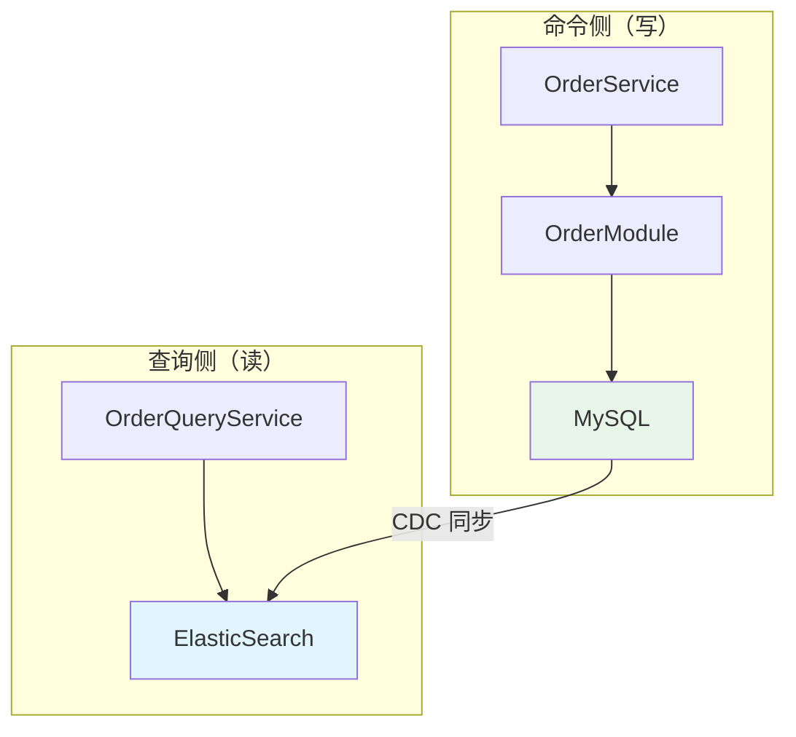

# DPMain 架构设计文档（第六部分）

## 目录
8. [总结与反思](#8-总结与反思)

---

## 8. 总结与反思

### 8.1 核心设计思想总结

#### 思想 1：实用主义的 DDD

**核心观点：**
> 架构设计的目的是解决实际问题，而不是为了理论完美。在中型项目中，适度的实用主义可以提高开发效率，避免过度设计。

**DPMain 的实用主义体现：**

| 经典 DDD 实践 | DPMain 的调整 | 理由 |
|--------------|--------------|------|
| Repository 接口在 Domain，实现在 Infrastructure | 接口和实现都在 `domains/repo/rporder` | 中型项目中，开发者需要频繁查看接口和实现，放在一起提高效率 |
| 严格隔离基础设施依赖 | DiagnosisModule 直接依赖 `lmstfy.Client` 和 `redis.PubSubClient` | Redis 和 Lmstfy 是基础设施服务（非数据存储），不需要 Repository 抽象 |
| 使用领域事件解耦 | Service 层直接编排多个 Module | 业务流程简单，直接调用比事件总线更清晰 |
| 严格分离持久化对象和领域对象 | Repository 内部转换，Service 层不感知 | 避免在多层之间传递转换逻辑 |

**核心原则：**
1. **保留 DDD 的核心价值**：实体封装业务规则、Repository 抽象数据访问、分层隔离关注点
2. **去除不必要的复杂性**：避免为了"纯粹"而引入不必要的抽象层
3. **以可维护性为第一目标**：代码组织清晰 > 理论完美

#### 思想 2：事件驱动的异步架构

**核心观点：**
> 通过消息队列 + 事件通知，实现服务解耦和高并发处理，同时通过 Smart Wait 提供"伪同步"的用户体验。

**架构优势：**


**关键设计：**
1. **订单创建成功不依赖诊断**：即使诊断失败，订单已持久化，可后续重试
2. **消息自包含**：诊断任务包含完整数据，诊断引擎无需查询数据库
3. **Redis Pub/Sub 事件通知**：毫秒级延迟，实时通知订单创建实例
4. **超时降级**：超时时返回 `DIAGNOSING` 状态，客户端可后续查询

#### 思想 3：单进程多 Goroutine 的简洁架构

**核心观点：**
> 在中型项目中，单进程多 Goroutine 比多进程/微服务更简洁、高效，Go 的并发模型天然支持这种架构。

**架构对比：**

| 维度 | 单进程多 Goroutine | 多进程部署 | 微服务架构 |
|------|------------------|-----------|----------|
| **部署复杂度** | ⭐ 单个二进制 | ⭐⭐ 需要进程编排 | ⭐⭐⭐ 需要服务编排 |
| **资源占用** | ⭐ 共享连接池 | ⭐⭐ 多个连接池 | ⭐⭐⭐ 更多资源 |
| **调试便利性** | ⭐ 单进程日志 | ⭐⭐ 多进程日志 | ⭐⭐⭐ 分布式追踪 |
| **容错能力** | ⭐⭐ 单点故障 | ⭐⭐⭐ 进程独立 | ⭐⭐⭐ 服务独立 |
| **适用场景** | 中型项目，团队 < 10 人 | 大型项目，团队 < 20 人 | 大型项目，团队 > 20 人 |

**DPMain 的选择依据：**
- 团队规模：3 人
- 业务复杂度：单一业务域（物流诊断）
- QPS 需求：< 1000（单进程足够）
- 运维能力：有限（单进程简化运维）

#### 思想 4：显式错误处理

**核心观点：**
> 所有错误都必须被处理，要么返回给调用方，要么记录日志。区分可恢复错误和致命错误，采取不同的处理策略。

**错误处理矩阵：**

| 错误类型 | 示例 | 处理策略 | 日志级别 | 是否返回错误 |
|---------|------|---------|---------|------------|
| **致命错误** | 数据库写入失败 | 立即返回错误，事务回滚 | `[ERROR]` | ✅ |
| **致命错误** | 业务规则违反（订单重复） | 立即返回错误 | `[WARN]` | ✅ |
| **可恢复错误** | 队列发布失败 | 记录日志，不阻断流程 | `[WARN]` | ❌ |
| **可恢复错误** | Smart Wait 超时 | 记录日志，返回 DIAGNOSING | `[WARN]` | ❌ |
| **预期行为** | Redis 订阅超时 | 记录日志，降级处理 | `[INFO]` | ❌ |

**关键实践：**
1. **使用 `%w` 包装错误**：保留错误链，便于追踪根因
2. **使用哨兵错误**：定义 `ErrInvalidStatus` 等错误，便于错误判断
3. **区分日志级别**：`[ERROR]` 触发告警，`[WARN]` 统计频率

### 8.2 项目中的经验教训

#### 经验 1：架构演进需要迭代

**教训：**
> 最初设计时，我们创建了 `DiagnosisService`，导致 `OrderModule` 依赖服务层（反向依赖）。后来重构为 `DiagnosisModule`，才解决了这个问题。

**反思：**
- 架构设计不可能一次到位，需要在实践中不断调整
- 反向依赖是常见的架构问题，发现后要及时重构
- 使用 Wire 等工具可以在编译期发现依赖问题

**如何避免：**
- 在设计阶段画出依赖关系图，检查是否有循环依赖
- 遵循"高层依赖低层，低层不依赖高层"的原则
- 定期 Code Review，检查架构是否退化

#### 经验 2：错误处理需要显式设计

**教训：**
> 最初实现 Smart Wait 时，错误被静默吞掉，导致订单卡在 `DIAGNOSING` 状态，但 API 返回成功。监控系统无法感知这类错误。

**反思：**
- Go 的错误处理是显式的，但开发者容易忽略错误检查
- 错误被吞掉比抛出错误更危险（silent failure）
- 监控告警依赖日志，没有日志就没有告警

**如何避免：**
- 使用 `golangci-lint` 的 `errcheck` 规则，强制检查所有错误
- 定义错误处理规范，明确哪些错误必须返回，哪些可以降级
- 所有错误必须有日志（即使降级处理）

#### 经验 3：测试覆盖率需要持续投入

**教训：**
> 项目初期没有单元测试，后期添加功能时，经常出现"改 A 功能，坏 B 功能"的情况。重构时也不敢大胆修改。

**反思：**
- 没有测试的代码是技术债务，长期会拖慢开发速度
- 分层架构的价值之一是易于测试，但需要主动编写测试
- 测试不是负担，而是加速器（重构时可以快速验证）

**如何改进：**
- 新增功能必须有单元测试（覆盖率 > 70%）
- 关键业务逻辑（如订单状态转换）必须有测试
- 使用 mock 工具（如 `gomock`）模拟依赖，提高测试速度

#### 经验 4：监控和日志需要提前规划

**教训：**
> 项目上线后，出现"队列发布失败"的问题，但因为日志不完整，排查花费了很长时间。

**反思：**
- 日志不是可选项，而是必需品
- 监控指标需要提前设计，上线后再加很被动
- 日志级别需要规范，否则告警规则无法设置

**如何改进：**
- 在开发阶段就集成 Prometheus + Grafana
- 定义日志规范：`[ERROR]` 立即告警，`[WARN]` 统计频率
- 关键业务流程（如订单创建）必须有指标和日志

### 8.3 未来的优化方向

#### 优化方向 1：引入分布式事务（Saga 模式）

**当前问题：**
> 如果在 Smart Wait 期间，内存中的 Order 实体已更新，但数据库更新失败，会导致数据不一致。

**解决方案：**
> 引入 Saga 模式，将订单创建流程拆分为多个事务步骤：
> 1. **创建订单**：持久化订单（status=DIAGNOSING）
> 2. **发布诊断任务**：发布到队列（失败时触发补偿事务）
> 3. **等待诊断结果**：订阅 Redis（超时时不需要补偿）
> 4. **更新诊断结果**：持久化结果（失败时触发补偿事务）

**技术选型：**
- **轻量级 Saga 框架**：`go-saga` 或自研
- **事件溯源**：记录每个步骤的事件，便于回滚和重试

#### 优化方向 2：引入 CQRS（读写分离）

**当前问题：**
> 查询订单列表和创建订单共享同一个数据库连接池，高并发查询可能影响写入性能。

**解决方案：**
> 引入 CQRS 模式：
> - **命令模型（写）**：OrderService → OrderModule → OrderRepository → MySQL
> - **查询模型（读）**：OrderQueryService → ElasticSearch / Redis

**架构变化：**


**优势：**
- 查询和写入解耦，互不影响
- 查询可以使用专门的搜索引擎（ElasticSearch），性能更好
- 支持复杂查询（如全文搜索、聚合统计）

#### 优化方向 3：引入限流和熔断

**当前问题：**
> 如果诊断引擎（DPSync）故障，大量订单会卡在 `DIAGNOSING` 状态，客户端会反复轮询，进一步增加负载。

**解决方案：**
> 引入限流和熔断机制：
> - **限流**：使用 `golang.org/x/time/rate` 限制 API 请求频率
> - **熔断**：使用 `go-hystrix` 检测 DPSync 故障，快速失败

**示例代码：**
```go
// 限流器
var limiter = rate.NewLimiter(100, 200)  // 每秒 100 个请求，突发 200

func (h *OrderHandler) CreateOrder(c *gin.Context) {
    if !limiter.Allow() {
        c.JSON(429, gin.H{"error": "too many requests"})
        return
    }

    // 正常处理...
}

// 熔断器
import "github.com/afex/hystrix-go/hystrix"

func (s *OrderService) CreateOrder(...) (*Order, error) {
    var order *Order
    err := hystrix.Do("create_order", func() error {
        var e error
        order, e = s.orderModule.CreateOrder(...)
        return e
    }, func(err error) error {
        // 熔断降级：返回默认值
        return errors.New("service unavailable")
    })

    return order, err
}
```

#### 优化方向 4：引入多租户支持

**当前问题：**
> 系统当前只支持单租户（固定 `OrgID=0`），如果需要支持多个商户隔离，需要大量改动。

**解决方案：**
> 在架构设计时预留多租户扩展点：
> 1. **数据库隔离**：在 `orders` 表中添加 `tenant_id` 字段
> 2. **Redis 隔离**：频道命名规则改为 `diagnosis:result:{tenant_id}:{order_id}`
> 3. **中间件验证**：在 API 层添加租户验证中间件

**架构变化：**
```go
// Entity 层添加 tenant_id
type Order struct {
    id       string
    tenantID string  // 新增
    // ...
}

// Repository 查询时过滤租户
func (r *OrderRepositoryImpl) GetByID(ctx context.Context, tenantID, orderID string) (*Order, error) {
    var po OrderPO
    if err := r.db.WithContext(ctx).First(&po, "tenant_id = ? AND id = ?", tenantID, orderID).Error; err != nil {
        return nil, err
    }
    return toDomainOrder(&po), nil
}

// Middleware 提取租户信息
func TenantMiddleware() gin.HandlerFunc {
    return func(c *gin.Context) {
        tenantID := c.GetHeader("X-Tenant-ID")
        if tenantID == "" {
            c.JSON(401, gin.H{"error": "missing tenant id"})
            c.Abort()
            return
        }

        c.Set("tenant_id", tenantID)
        c.Next()
    }
}
```

### 8.4 给后来者的建议

#### 建议 1：先理解业务，再设计架构

**核心观点：**
> 架构是为业务服务的，不要为了技术而技术。

**实践方法：**
1. **从用户故事开始**：理解用户的真实需求
2. **识别核心业务流程**：画出业务流程图
3. **识别关键约束**：性能、可用性、一致性的优先级
4. **选择合适的架构模式**：单体、微服务、事件驱动等

**反面案例：**
> "我们要用微服务，因为大厂都在用。" → 导致过度设计，团队陷入架构泥潭。

#### 建议 2：分层架构不是银弹

**核心观点：**
> 分层架构适用于中大型项目，但小型项目（< 3 个表）可能不需要。

**判断标准：**
- **业务复杂度**：业务规则复杂，状态转换多 → 适合 DDD
- **团队规模**：团队 > 5 人，需要代码组织清晰 → 适合分层
- **长期维护**：项目会长期维护，不是一次性项目 → 适合分层

**不适用场景：**
- 快速原型验证（MVP）
- 一次性脚本工具
- 简单的 CRUD 应用

#### 建议 3：测试是架构的一部分

**核心观点：**
> 好的架构应该是易于测试的，如果测试很难写，说明架构有问题。

**实践方法：**
1. **依赖注入**：通过构造函数注入依赖，便于 mock
2. **接口抽象**：Service 依赖 Module 接口，而不是具体实现
3. **纯函数优先**：实体的业务方法是纯函数，易于测试

**测试金字塔：**
```
         /\
        /  \  E2E 测试（少量）
       /    \
      /------\  集成测试（适量）
     /--------\
    /----------\  单元测试（大量）
```

#### 建议 4：架构需要迭代演进

**核心观点：**
> 没有完美的架构，只有适合当前阶段的架构。架构需要随着业务发展不断演进。

**演进路径：**
```
单体应用 → 模块化单体 → 微服务
```

**DPMain 的演进路径：**
1. **MVP 阶段**：单体应用，所有逻辑在 Handler 中
2. **当前阶段**：模块化单体，DDD 分层架构
3. **未来阶段**：如果订单量 > 10 万/天，考虑拆分为微服务

**关键原则：**
- **不要过度设计**：不要为了未来可能的需求而增加复杂度
- **不要欠债太多**：技术债务需要定期偿还，否则会拖垮项目
- **保持架构一致性**：演进时要保持整体架构风格一致

#### 建议 5：文档是架构的延续

**核心观点：**
> 代码会说谎，文档不会。好的架构需要配套的文档，帮助新人快速上手。

**文档清单：**
1. **架构设计文档**（本文档）：解释"为什么"这样设计
2. **API 文档**：使用 OpenAPI / Swagger 生成
3. **数据库设计文档**：ER 图 + 字段说明
4. **部署文档**：环境配置、依赖安装、启动命令
5. **故障排查文档**：常见问题 + 解决方案

**文档编写原则：**
- **解释"为什么"，而不仅仅是"是什么"**：架构决策的背景和理由
- **配图优于文字**：使用 Mermaid 绘制架构图、流程图
- **保持更新**：代码改动时，同步更新文档

---

## 9. 附录

### 9.1 目录结构

```
dpmain/
├── cmd/
│   └── apiserver/
│       ├── main.go                # 应用入口
│       ├── wire.go                # Wire 依赖注入配置
│       └── wire_gen.go            # Wire 生成的代码
│
├── internal/
│   └── app/
│       ├── config/                # 配置管理
│       │   └── config.go
│       │
│       ├── domains/               # 领域层
│       │   ├── entity/            # 实体和值对象
│       │   │   ├── etorder/       # 订单聚合
│       │   │   │   ├── order.go
│       │   │   │   ├── shipment.go
│       │   │   │   └── diagnose_result.go
│       │   │   └── etaccount/     # 账号聚合
│       │   │       └── account.go
│       │   │
│       │   ├── repo/              # 仓储层
│       │   │   ├── rporder/
│       │   │   │   ├── order_repository.go       # 接口
│       │   │   │   └── order_repo_impl.go        # 实现
│       │   │   └── rpaccount/
│       │   │       ├── account_repository.go
│       │   │       └── account_repo_impl.go
│       │   │
│       │   ├── modules/           # 模块层
│       │   │   ├── mdorder/
│       │   │   │   └── order_module.go
│       │   │   ├── mdaccount/
│       │   │   │   └── account_module.go
│       │   │   └── mddiagnosis/
│       │   │       └── diagnosis_module.go
│       │   │
│       │   └── services/          # 服务层
│       │       ├── svorder/
│       │       │   └── order_service.go
│       │       ├── svaccount/
│       │       │   └── account_service.go
│       │       └── svcallback/
│       │           └── callback_service.go
│       │
│       ├── server/                # API 层
│       │   ├── handlers/
│       │   │   ├── order/
│       │   │   │   ├── order_handler.go
│       │   │   │   └── dto.go
│       │   │   └── account/
│       │   │       ├── account_handler.go
│       │   │       └── dto.go
│       │   └── routers/
│       │       └── router.go
│       │
│       ├── consumer/              # 消费者
│       │   ├── callback_consumer.go
│       │   └── config.go
│       │
│       ├── infra/                 # 基础设施层
│       │   ├── persistence/
│       │   │   └── redis/
│       │   │       └── pubsub_client.go
│       │   └── mq/
│       │       └── lmstfy/
│       │           └── client.go
│       │
│       └── pkg/                   # 公共工具
│           ├── logger/
│           │   └── logger.go
│           └── metrics/
│               └── metrics.go
│
├── docs/                          # 文档
│   ├── 01_business_background_and_approach.md
│   ├── 02_ddd_theory_and_application.md
│   ├── 03_core_architecture_design.md
│   ├── 04_key_technical_decisions.md
│   ├── 05_extensibility_and_interview.md
│   └── 06_summary_and_reflection.md
│
├── tests/                         # 测试
│   ├── unit/                      # 单元测试
│   ├── integration/               # 集成测试
│   └── load/                      # 性能测试（k6）
│       ├── create_order_no_wait.js
│       ├── create_order_with_wait.js
│       └── list_orders.js
│
├── go.mod
├── go.sum
├── Makefile
└── README.md
```

### 9.2 技术栈清单

| 类别 | 技术 | 用途 |
|------|------|------|
| **语言** | Go 1.21 | 主要开发语言 |
| **Web 框架** | Gin | HTTP API 框架 |
| **ORM** | GORM | 数据库 ORM |
| **数据库** | MySQL 8.0 | 主数据库 |
| **缓存** | Redis 6.0 | Pub/Sub 事件通知 |
| **消息队列** | Lmstfy | 异步任务队列 |
| **依赖注入** | Wire | 编译期依赖注入 |
| **监控** | Prometheus + Grafana | 指标监控和可视化 |
| **链路追踪** | Jaeger + OpenTelemetry | 分布式追踪 |
| **日志** | Zap | 结构化日志 |
| **配置管理** | Viper | 配置文件解析 |
| **测试** | go test + gomock | 单元测试和 mock |
| **压测** | k6 | 性能压测 |
| **容器化** | Docker + Kubernetes | 容器化部署 |

### 9.3 关键指标

#### 性能指标

| 指标 | 目标值 | 当前值 | 备注 |
|------|-------|--------|------|
| **订单创建（无 Smart Wait）** | P95 < 200ms | 120ms | 包含数据库写入 + 队列发布 |
| **订单创建（Smart Wait）** | P95 < 5s | 3.5s | 包含等待诊断结果 |
| **订单查询** | P95 < 100ms | 80ms | 单条查询 |
| **订单列表查询** | P95 < 200ms | 150ms | 20 条/页 |
| **Smart Wait 成功率** | > 80% | 85% | 5 秒内获得结果的比例 |

#### 可用性指标

| 指标 | 目标值 | 备注 |
|------|-------|------|
| **系统可用性** | 99.9% | 每月故障时间 < 43 分钟 |
| **队列发布成功率** | > 99% | Lmstfy 可用性 |
| **Redis 订阅成功率** | > 95% | Redis Pub/Sub 可用性 |

#### 业务指标

| 指标 | 备注 |
|------|------|
| **订单创建量** | 10,000/天（当前），100,000/天（目标） |
| **诊断通过率** | 90%（可发货订单占比） |
| **平均诊断时长** | 2.3 秒 |

### 9.4 常见问题 FAQ

#### Q1: 为什么不使用微服务架构？

**A:** 微服务架构适合大型项目（团队 > 20 人，业务域 > 5 个）。DPMain 是中型项目，团队 3 人，业务域单一（物流诊断），单体架构更简洁高效。

#### Q2: 为什么 Repository 实现放在 domains/repo 而不是 infra？

**A:** 这是实用主义的权衡。在中型项目中，开发者需要频繁查看接口和实现，放在一起提高开发效率。通过依赖注入管理依赖，仍然可以保证可测试性和可替换性。

#### Q3: Smart Wait 会不会导致连接耗尽？

**A:** 不会。Smart Wait 通过 Redis Pub/Sub 实现，是事件驱动的，只在有结果时才返回。相比数据库轮询，资源占用更低。我们的压测结果显示，20 并发的 Smart Wait 请求，服务器负载正常。

#### Q4: 如果 Redis 故障，Smart Wait 会怎样？

**A:** Redis 订阅失败时，我们将错误记录为 `[WARN]` 级别，然后返回 `status=DIAGNOSING` 的订单。这是降级策略，不影响订单创建成功，客户端可以后续查询。

#### Q5: 为什么不使用 gRPC 替代 HTTP？

**A:** gRPC 适合内部服务间通信，但 DPMain 的 API 主要面向外部商户，HTTP + JSON 更通用，便于客户端集成。如果未来有高性能内部服务（如诊断引擎），可以考虑 gRPC。

#### Q6: 如何保证订单创建的幂等性？

**A:** 我们通过 `(account_id, merchant_order_no)` 组合索引检查订单重复。客户端使用商户订单号作为幂等键，多次提交同一个订单号会被拒绝。

#### Q7: 如何扩展到多租户？

**A:** 在 `orders` 表中添加 `tenant_id` 字段，在 API 层添加租户验证中间件，在 Repository 查询时过滤租户。Redis 频道命名规则改为 `diagnosis:result:{tenant_id}:{order_id}`。

#### Q8: 为什么不使用 Kafka 替代 Lmstfy？

**A:** Kafka 是重量级消息队列，适合大规模日志采集和流处理。Lmstfy 是轻量级任务队列，满足我们的需求（< 10,000 任务/天），运维成本更低。

---

## 10. 结语

DPMain 是一个典型的中型 Go 项目，通过实用主义的 DDD 分层架构，实现了清晰的代码组织和良好的可维护性。Smart Wait 机制是本项目的核心创新，在异步架构的基础上提供了"伪同步"的用户体验。

希望这份文档能够帮助你：
1. **理解 DDD 的核心思想**，以及如何在实际项目中应用
2. **学习架构权衡的方法**，避免过度设计和欠债过多
3. **掌握面试技巧**，使用 STAR 方法讲述项目亮点
4. **提升架构设计能力**，从业务出发，选择合适的技术方案

**记住：**
> 架构设计不是为了炫技，而是为了解决实际问题。好的架构应该是简洁、清晰、易于维护的。

祝你在架构设计的道路上越走越远！🚀

---

## 文档变更记录

| 版本 | 日期 | 作者 | 变更内容 |
|------|------|------|---------|
| v1.0 | 2025-12-30 | Claude Sonnet 4.5 | 初始版本，完整架构设计文档 |
